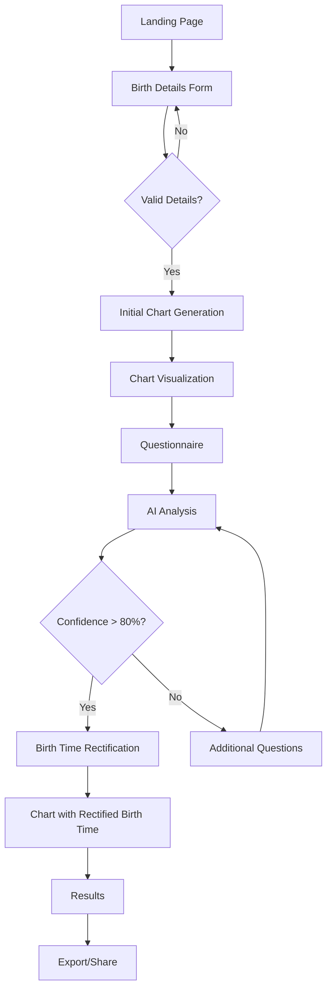

# Birth Time Rectifier - Testing Guide

This document provides information about the testing framework for the Birth Time Rectifier application, focused on the consolidated test script.

## Overview

The test suite verifies the complete astrological chart application flow using Playwright for browser-based testing. It follows the application flow diagram:



## Consolidated Test Script

The `consolidated-app-flow-test.sh` script provides a unified interface for testing all aspects of the Birth Time Rectifier application. It combines the functionality of previous test scripts (`run-app-flow-test.sh` and `run-application-and-tests.sh`) into a single, powerful testing tool.

### Features

- **Menu-driven interface** for interactive testing
- **CLI options** for automation and CI/CD integration
- **Service management** for Docker containers
- **API endpoint validation**
- **Support for all application flows**
- **Enhanced error handling and reporting**
- **Docker integration** for containerized testing
- **Flexible worker configuration**

### Available Test Patterns

1. **Complete Application Flow** (A→B→C→D→E→F→G→H→I→K→L→M)
   - Tests all 8 steps of the application
   - Verifies chart generation, visualization, questionnaire, and results

2. **Validation Failure Path** (A→B→C→B)
   - Tests form validation
   - Verifies error messages and field validation

3. **Low Confidence Path** (G→H→J→G)
   - Tests AI analysis with low confidence
   - Verifies additional question handling

4. **Boundary Cases**
   - Tests edge cases with extreme coordinates
   - Includes polar coordinates, date line crossing, and equator crossing

5. **API Endpoints Validation**
   - Verifies all API endpoints are correctly configured
   - Tests response codes and formats

## Usage

### Basic Usage

```bash
./consolidated-app-flow-test.sh
```

This will run the default test pattern (complete application flow) with standard settings.

### Menu-driven Mode

```bash
./consolidated-app-flow-test.sh --menu
```

This will launch the interactive menu interface, allowing you to:
- Select specific test patterns
- View test summary reports
- Manage Docker services
- Verify API endpoint configuration

### Command-line Options

```bash
# Run without installing dependencies
./consolidated-app-flow-test.sh --no-deps

# Run without starting services (if already running)
./consolidated-app-flow-test.sh --no-services

# Run specific test pattern
./consolidated-app-flow-test.sh --test-pattern "validation failure path"

# Run with multiple workers
./consolidated-app-flow-test.sh --workers 3

# Run all test patterns sequentially
./consolidated-app-flow-test.sh --all-tests

# Run with verbose output
./consolidated-app-flow-test.sh --verbose

# Run without Docker (locally)
./consolidated-app-flow-test.sh --no-docker

# Run in CI mode (automated)
./consolidated-app-flow-test.sh --ci
```

## Test Constants

The test suite uses centralized constants defined in `tests/e2e/constants.js` for API endpoints and test data.

### API Endpoints

```javascript
export const API_ENDPOINTS = {
    validate: '/api/validate',
    geocode: '/api/geocode',
    chartGenerate: '/api/chart/generate',
    chartById: '/api/chart/{id}',
    questionnaire: '/api/questionnaire',
    rectify: '/api/rectify',
    export: '/api/export',
    // Additional endpoints...
};
```

### Test Data

```javascript
export const TEST_DATA = {
    // Standard test case for happy path
    STANDARD: {
        birthDate: '1985-10-24',
        birthTime: '14:30',
        birthPlace: 'Pune, India',
        // Additional data...
    },
    // Test cases for validation errors, low confidence, boundary cases...
};
```

## Test Files Organization

- `consolidated-app-flow-test.sh`: Main test script
- `tests/e2e/constants.js`: API endpoints and test data
- `tests/e2e/chart.spec.js`: Test implementations
- `playwright.config.js`: Playwright configuration

## Prerequisites

- Node.js and npm
- Docker and Docker Compose
- Playwright
- Bash shell

## Troubleshooting

### Common Issues

1. **Services Not Starting**
   - Check Docker status: `docker ps`
   - Verify docker-compose.yml configuration
   - Check logs: `docker compose logs`

2. **Test Failures**
   - Check API endpoint configuration in constants.js
   - Verify environment variables
   - Run with --verbose flag for detailed output

3. **Docker Connection Issues**
   - For macOS users, ensure `DOCKER_HOST` is set correctly
   - Verify Docker socket path

### Getting Help

For additional assistance, run:

```bash
./consolidated-app-flow-test.sh --help
```

## CI/CD Integration

The consolidated test script is designed for easy integration with CI/CD pipelines:

```yaml
# Example GitHub Actions workflow
steps:
  - uses: actions/checkout@v3
  - name: Run tests
    run: ./consolidated-app-flow-test.sh --ci --no-prompt
```

## Maintenance

- Keep API endpoints in constants.js updated when backend changes
- Update test data as needed for different scenarios
- Add new test patterns as application features evolve
