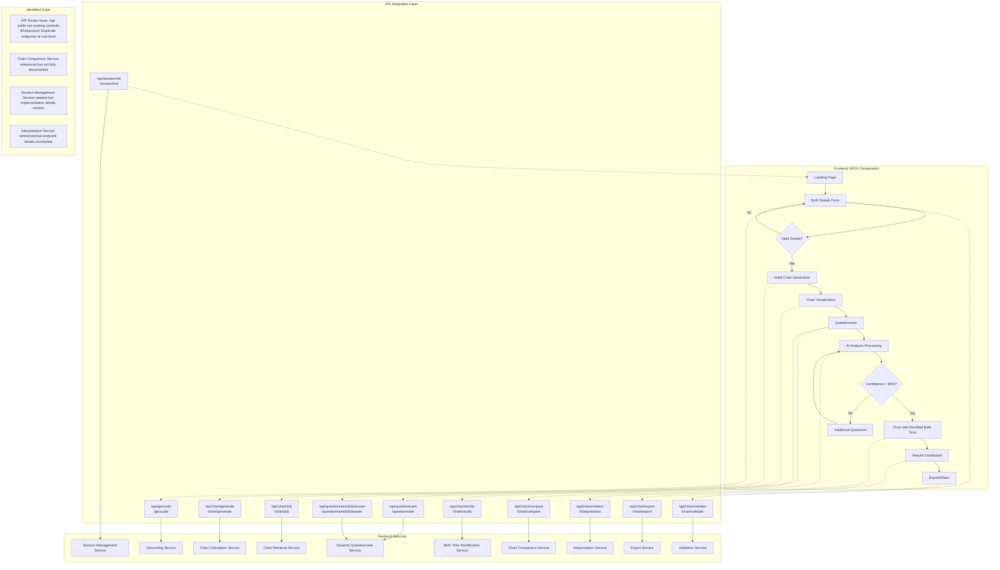
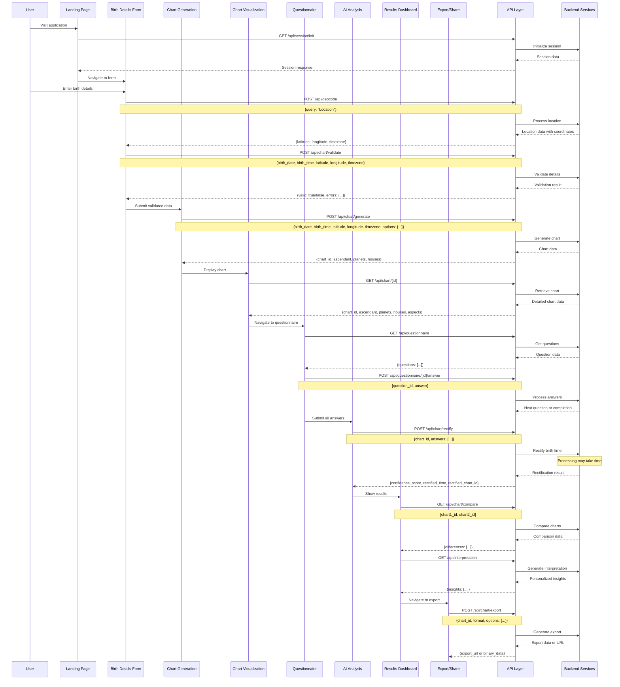
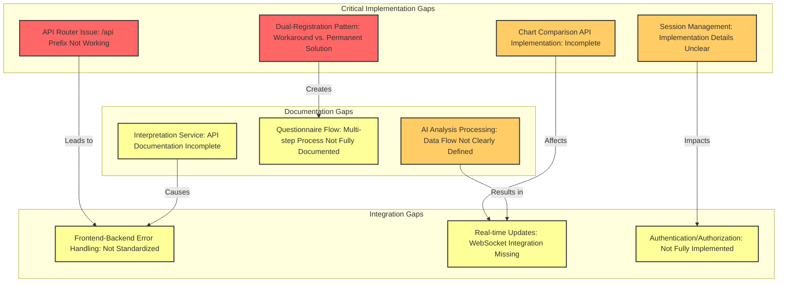

# Birth Time Rectifier API Documentation

## Overview

This document provides comprehensive documentation for the Birth Time Rectifier API, which allows developers to integrate astrological chart generation and birth time rectification capabilities into their applications.

## Base URL

```
https://api.birthrectifier.example.com
```

All endpoints are available at both `/api/[endpoint]` and `/[endpoint]` paths for backward compatibility.

## Authentication

### Bearer Token Authentication

Most API endpoints require authentication using a Bearer token.

```
Authorization: Bearer <your_token>
```

To obtain a token, use the authentication endpoints described below.

## API Endpoints

### Health Check

#### GET /health

Check if the API is operational.

**Authentication Required**: No

**Response**:
```json
{
  "status": "ok",
  "version": "1.0.0",
  "timestamp": "2023-06-15T12:34:56Z"
}
```

### Authentication

#### POST /auth/register

Register a new user account.

**Authentication Required**: No

**Request Body**:
```json
{
  "email": "user@example.com",
  "password": "securePassword123",
  "name": "John Doe"
}
```

**Response**:
```json
{
  "user_id": "usr_123456789",
  "email": "user@example.com",
  "name": "John Doe",
  "created_at": "2023-06-15T12:34:56Z"
}
```

#### POST /auth/login

Authenticate a user and receive an access token.

**Authentication Required**: No

**Request Body**:
```json
{
  "email": "user@example.com",
  "password": "securePassword123"
}
```

**Response**:
```json
{
  "access_token": "eyJhbGciOiJIUzI1NiIsInR5cCI6IkpXVCJ9...",
  "token_type": "bearer",
  "expires_in": 3600,
  "refresh_token": "eyJhbGciOiJIUzI1NiIsInR5cCI6IkpXVCJ9..."
}
```

#### POST /auth/refresh

Refresh an expired access token.

**Authentication Required**: No

**Request Body**:
```json
{
  "refresh_token": "eyJhbGciOiJIUzI1NiIsInR5cCI6IkpXVCJ9..."
}
```

**Response**:
```json
{
  "access_token": "eyJhbGciOiJIUzI1NiIsInR5cCI6IkpXVCJ9...",
  "token_type": "bearer",
  "expires_in": 3600,
  "refresh_token": "eyJhbGciOiJIUzI1NiIsInR5cCI6IkpXVCJ9..."
}
```

### Geocoding

#### POST /geocoding/search

Search for a location by name.

**Authentication Required**: Yes

**Request Body**:
```json
{
  "query": "New York, USA"
}
```

**Response**:
```json
{
  "results": [
    {
      "id": "loc_123456",
      "name": "New York City",
      "country": "United States",
      "country_code": "US",
      "state": "New York",
      "latitude": 40.7128,
      "longitude": -74.0060,
      "timezone": "America/New_York"
    }
  ]
}
```

#### GET /geocoding/{location_id}

Get detailed information about a specific location.

**Authentication Required**: Yes

**Parameters**:
- `location_id` (path): The unique identifier for the location

**Response**:
```json
{
  "id": "loc_123456",
  "name": "New York City",
  "country": "United States",
  "country_code": "US",
  "state": "New York",
  "latitude": 40.7128,
  "longitude": -74.0060,
  "timezone": "America/New_York",
  "timezone_offset": "-05:00",
  "dst_observed": true
}
```

### Chart Generation

#### POST /charts/generate

Generate an astrological chart based on birth details.

**Authentication Required**: Yes

**Request Body**:
```json
{
  "birth_date": "1990-01-15",
  "birth_time": "14:30:00",
  "latitude": 40.7128,
  "longitude": -74.0060,
  "location_name": "New York City, USA",
  "house_system": "placidus",
  "chart_type": "tropical"
}
```

**Response**:
```json
{
  "chart_id": "chrt_987654321",
  "birth_details": {
    "date": "1990-01-15",
    "time": "14:30:00",
    "location": {
      "name": "New York City, USA",
      "latitude": 40.7128,
      "longitude": -74.0060
    }
  },
  "planets": [
    {
      "name": "Sun",
      "sign": "Capricorn",
      "degree": 25.42,
      "house": 5,
      "retrograde": false
    },
    {
      "name": "Moon",
      "sign": "Taurus",
      "degree": 15.78,
      "house": 9,
      "retrograde": false
    },
    // Additional planets...
  ],
  "houses": [
    {
      "number": 1,
      "sign": "Virgo",
      "degree": 15.32
    },
    // Additional houses...
  ],
  "aspects": [
    {
      "planet1": "Sun",
      "planet2": "Mercury",
      "type": "conjunction",
      "orb": 2.3,
      "applying": false
    },
    // Additional aspects...
  ],
  "ascendant": {
    "sign": "Virgo",
    "degree": 15.32
  },
  "midheaven": {
    "sign": "Taurus",
    "degree": 10.45
  },
  "ketu": {
    "sign": "Pisces",
    "degree": 5.67,
    "house": 7,
    "retrograde": true
  }
}
```

#### GET /charts/{chart_id}

Retrieve a previously generated chart.

**Authentication Required**: Yes

**Parameters**:
- `chart_id` (path): The unique identifier for the chart

**Response**: Same as the response for POST /charts/generate

### Birth Time Rectification

#### POST /rectification/initialize

Initialize a birth time rectification process.

**Authentication Required**: Yes

**Request Body**:
```json
{
  "chart_id": "chrt_987654321",
  "birth_time_certainty": "approximate",
  "birth_time_range": {
    "min_hours": 13,
    "min_minutes": 0,
    "max_hours": 16,
    "max_minutes": 0
  }
}
```

**Response**:
```json
{
  "rectification_id": "rect_123456789",
  "status": "initialized",
  "chart_id": "chrt_987654321",
  "next_step": "questionnaire",
  "questionnaire_url": "/questionnaire/rect_123456789/start"
}
```

#### GET /rectification/{rectification_id}/status

Check the status of a rectification process.

**Authentication Required**: Yes

**Parameters**:
- `rectification_id` (path): The unique identifier for the rectification process

**Response**:
```json
{
  "rectification_id": "rect_123456789",
  "status": "in_progress",
  "progress_percentage": 45,
  "current_step": "analyzing_events",
  "estimated_completion_time": "2023-06-15T13:30:00Z"
}
```

### Questionnaire

#### GET /questionnaire/{rectification_id}/start

Get the first question in the rectification questionnaire.

**Authentication Required**: Yes

**Parameters**:
- `rectification_id` (path): The unique identifier for the rectification process

**Response**:
```json
{
  "question_id": "q_001",
  "text": "Have you experienced any major career changes?",
  "type": "yes_no",
  "next_question_url": "/questionnaire/rect_123456789/question/q_002"
}
```

#### GET /questionnaire/{rectification_id}/question/{question_id}

Get a specific question in the rectification questionnaire.

**Authentication Required**: Yes

**Parameters**:
- `rectification_id` (path): The unique identifier for the rectification process
- `question_id` (path): The unique identifier for the question

**Response**:
```json
{
  "question_id": "q_002",
  "text": "When did your most significant career change occur?",
  "type": "date",
  "next_question_url": "/questionnaire/rect_123456789/question/q_003",
  "previous_question_url": "/questionnaire/rect_123456789/question/q_001"
}
```

#### POST /questionnaire/{rectification_id}/answer

Submit an answer to a question.

**Authentication Required**: Yes

**Parameters**:
- `rectification_id` (path): The unique identifier for the rectification process

**Request Body**:
```json
{
  "question_id": "q_002",
  "answer": {
    "date": "2018-03-15",
    "additional_notes": "Changed from finance to technology sector"
  }
}
```

**Response**:
```json
{
  "status": "accepted",
  "next_question_url": "/questionnaire/rect_123456789/question/q_003"
}
```

#### POST /questionnaire/{rectification_id}/complete

Complete the questionnaire and start the rectification analysis.

**Authentication Required**: Yes

**Parameters**:
- `rectification_id` (path): The unique identifier for the rectification process

**Response**:
```json
{
  "status": "processing",
  "estimated_completion_time": "2023-06-15T13:30:00Z",
  "results_url": "/rectification/rect_123456789/results"
}
```

### Rectification Results

#### GET /rectification/{rectification_id}/results

Get the results of a completed rectification process.

**Authentication Required**: Yes

**Parameters**:
- `rectification_id` (path): The unique identifier for the rectification process

**Response**:
```json
{
  "rectification_id": "rect_123456789",
  "status": "completed",
  "original_birth_time": "14:30:00",
  "rectified_birth_time": "15:12:00",
  "confidence_score": 87.5,
  "explanation": "Based on your career change in 2018 and relationship events, the rectified time shows a stronger Saturn-MC aspect which better explains the timing of your career transition.",
  "rectified_chart_id": "chrt_987654322",
  "key_changes": [
    {
      "type": "house_cusp_shift",
      "house": 10,
      "original_position": {
        "sign": "Taurus",
        "degree": 10.45
      },
      "rectified_position": {
        "sign": "Taurus",
        "degree": 15.78
      }
    },
    {
      "type": "planet_house_transition",
      "planet": "Mars",
      "original_house": 3,
      "rectified_house": 4
    }
  ]
}
```

### Chart Comparison

#### GET /charts/compare

Compare two astrological charts.

**Authentication Required**: Yes

**Query Parameters**:
- `chart1_id` (query): The ID of the first chart
- `chart2_id` (query): The ID of the second chart
- `comparison_type` (query, optional): The type of comparison (default: "differences")

**Response**:
```json
{
  "comparison_id": "comp_123456789",
  "chart1_id": "chrt_987654321",
  "chart2_id": "chrt_987654322",
  "comparison_type": "differences",
  "differences": [
    {
      "type": "ascendant_shift",
      "chart1_position": {
        "sign": "Virgo",
        "degree": 15.32
      },
      "chart2_position": {
        "sign": "Virgo",
        "degree": 18.75
      }
    },
    {
      "type": "planet_house_transition",
      "planet": "Mars",
      "chart1_house": 3,
      "chart2_house": 4
    },
    {
      "type": "aspect_change",
      "aspect": {
        "planet1": "Sun",
        "planet2": "Saturn"
      },
      "chart1_aspect": {
        "type": "square",
        "orb": 3.2
      },
      "chart2_aspect": {
        "type": "square",
        "orb": 1.8
      }
    }
  ]
}
```

### Export

#### POST /export/chart

Export a chart in various formats.

**Authentication Required**: Yes

**Request Body**:
```json
{
  "chart_id": "chrt_987654321",
  "format": "pdf",
  "include_interpretation": true,
  "language": "en"
}
```

**Response**:
```json
{
  "export_id": "exp_123456789",
  "status": "processing",
  "estimated_completion_time": "2023-06-15T12:40:00Z",
  "download_url": "/export/exp_123456789/download"
}
```

#### GET /export/{export_id}/download

Download an exported chart.

**Authentication Required**: Yes

**Parameters**:
- `export_id` (path): The unique identifier for the export

**Response**: Binary file data with appropriate Content-Type header

## Error Handling

All API endpoints follow a consistent error response format:

```json
{
  "error": {
    "code": "invalid_request",
    "message": "The request was invalid",
    "details": [
      {
        "field": "birth_time",
        "issue": "Invalid time format. Expected HH:MM:SS"
      }
    ]
  }
}
```

### Common Error Codes

| Code | Description |
|------|-------------|
| `authentication_required` | Authentication is required for this endpoint |
| `invalid_credentials` | The provided credentials are invalid |
| `invalid_request` | The request was invalid or malformed |
| `resource_not_found` | The requested resource was not found |
| `rate_limit_exceeded` | You have exceeded the rate limit for this endpoint |
| `server_error` | An unexpected server error occurred |

## Rate Limiting

API requests are subject to rate limiting to ensure fair usage. The current limits are:

- 60 requests per minute for authenticated users
- 10 requests per minute for unauthenticated endpoints

Rate limit information is included in the response headers:

```
X-RateLimit-Limit: 60
X-RateLimit-Remaining: 58
X-RateLimit-Reset: 1623761400
```

## Webhooks

The API supports webhooks for asynchronous notifications about events.

### Webhook Events

| Event | Description |
|-------|-------------|
| `rectification.completed` | A birth time rectification process has completed |
| `chart.generated` | A new chart has been generated |
| `export.ready` | An export is ready for download |

### Webhook Payload

```json
{
  "event": "rectification.completed",
  "timestamp": "2023-06-15T13:30:00Z",
  "data": {
    "rectification_id": "rect_123456789",
    "status": "completed",
    "results_url": "/rectification/rect_123456789/results"
  }
}
```

### Registering Webhooks

To register a webhook, use the following endpoint:

#### POST /webhooks/register

**Authentication Required**: Yes

**Request Body**:
```json
{
  "url": "https://your-app.example.com/webhooks/birth-rectifier",
  "events": ["rectification.completed", "export.ready"],
  "secret": "your_webhook_secret"
}
```

**Response**:
```json
{
  "webhook_id": "wh_123456789",
  "url": "https://your-app.example.com/webhooks/birth-rectifier",
  "events": ["rectification.completed", "export.ready"],
  "created_at": "2023-06-15T12:34:56Z"
}
```

## API Integration Flows and Gaps

This section outlines the integration flows between frontend components and API endpoints, as well as identified integration gaps.

### Complete Application Flow with API Endpoints

The following diagram illustrates the complete flow of the application, showing how frontend UI/UX components interact with API endpoints:



### API Request/Response Sequence

This sequence diagram illustrates the detailed request/response flow between frontend components, API endpoints, and backend services:



### Integration Gaps Analysis

The following diagram classifies and shows the relationships between identified integration gaps:



### Gap Details and Mitigation

#### Critical Implementation Gaps

1. **API Router Issue: /api Prefix Not Working**
   - **Issue**: The `/api` prefix routing is not working correctly
   - **Workaround**: Dual-registration pattern where endpoints are registered both with and without the `/api` prefix
   - **Impact**: Development complexity, potential for inconsistent behavior
   - **Mitigation**: Investigate FastAPI router configuration, fix root cause of prefix issue

2. **Chart Comparison API Implementation: Incomplete**
   - **Issue**: The Chart Comparison Service is referenced in the flow but implementation details are incomplete
   - **Impact**: Limited ability to compare original and rectified charts
   - **Mitigation**: Complete implementation with detailed documentation

3. **Dual-Registration Pattern: Workaround vs. Permanent Solution**
   - **Issue**: The dual-registration pattern is a workaround rather than a permanent solution
   - **Impact**: Code duplication, maintenance complexity
   - **Mitigation**: Resolve API router issue, implement proper routing with deprecation strategy

4. **Session Management: Implementation Details Unclear**
   - **Issue**: Session management service is needed but implementation details are unclear
   - **Impact**: Limited user session persistence, potential for authentication issues
   - **Mitigation**: Document and implement comprehensive session management

#### Documentation Gaps

1. **Interpretation Service: API Documentation Incomplete**
   - **Issue**: The Interpretation Service is referenced for the Results page but endpoint specifications are incomplete
   - **Impact**: Limited understanding of how to use interpretation features
   - **Mitigation**: Complete documentation with examples and expected response formats

2. **Questionnaire Flow: Multi-step Process Not Fully Documented**
   - **Issue**: The multi-step questionnaire process lacks detailed API documentation
   - **Impact**: Difficult to implement client-side questionnaire flow
   - **Mitigation**: Add sequence diagrams and step-by-step guides

3. **AI Analysis Processing: Data Flow Not Clearly Defined**
   - **Issue**: The data flow for AI analysis processing is not clearly defined
   - **Impact**: Limited understanding of how to process and interpret AI analysis results
   - **Mitigation**: Document the complete data flow with examples

#### Integration Gaps

1. **Frontend-Backend Error Handling: Not Standardized**
   - **Issue**: Error handling across frontend-backend interactions is not standardized
   - **Impact**: Inconsistent error messages, difficult debugging
   - **Mitigation**: Implement standardized error handling with clear error codes

2. **Real-time Updates: WebSocket Integration Missing**
   - **Issue**: No WebSocket or SSE implementation for long-running processes like AI analysis
   - **Impact**: Limited real-time feedback during processing
   - **Mitigation**: Implement WebSocket support for progress updates

3. **Authentication/Authorization: Not Fully Implemented**
   - **Issue**: Authentication and authorization not fully implemented in the documented API flow
   - **Impact**: Limited security controls, potential for unauthorized access
   - **Mitigation**: Implement comprehensive authentication and authorization

## SDK Libraries

We provide official SDK libraries for easy integration:

- [JavaScript/TypeScript](https://github.com/birth-rectifier/js-sdk)
- [Python](https://github.com/birth-rectifier/python-sdk)
- [PHP](https://github.com/birth-rectifier/php-sdk)
- [Ruby](https://github.com/birth-rectifier/ruby-sdk)

## Changelog

### v1.0.0 (2023-06-01)
- Initial API release

### v1.1.0 (2023-07-15)
- Added support for Ketu calculations
- Improved accuracy of Ascendant calculations
- Added chart comparison endpoint

## Support

If you encounter any issues or have questions about the API, please contact our support team at api-support@birthrectifier.example.com or visit our [Developer Portal](https://developers.birthrectifier.example.com).
