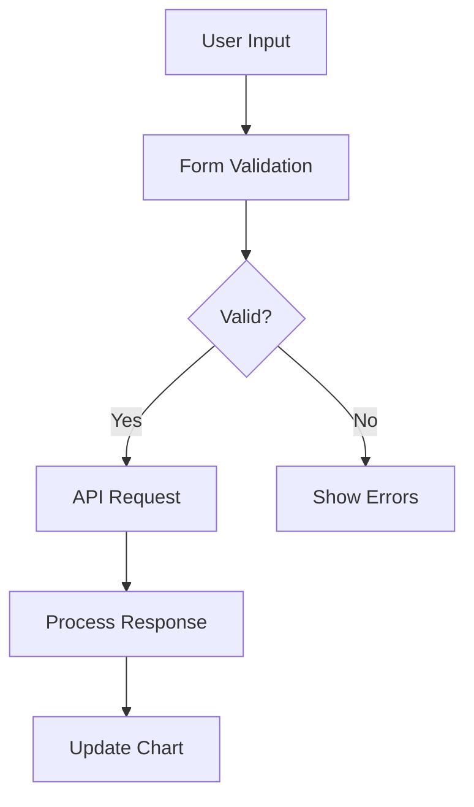
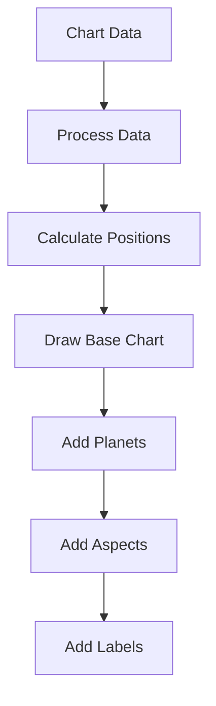

# System Patterns

## Form Validation Patterns
1. **Real-time Validation**
   - Immediate validation on input/change events
   - Deferred validation on blur events
   - Error state management through React state
   - HTML5 input validation handling

2. **Error Handling**
   - Role-based error messages for accessibility
   - Consistent error message styling
   - Field-level error state management
   - Form-level validation state

3. **Input Event Handling**
   - Combined input/change event handling for HTML5 inputs
   - Touch state tracking for validation timing
   - Blur event handling for validation confirmation

## Type Management Patterns
1. **Union Types for Flexibility**
   - Handling properties that can be multiple types (e.g., `ascendant` as number or object)
   - Type guards for conditional rendering
   - Type narrowing in component logic
   - Explicit return type annotations

2. **Nested Object Structures**
   - Proper nesting for complex data (e.g., `coordinates` within `BirthDetails`)
   - Consistent access patterns with optional chaining
   - Default values for potentially undefined properties
   - Immutable state updates preserving structure

3. **Interface Consistency**
   - Component prop interfaces with required vs optional properties
   - API communication interfaces matching backend expectations
   - Consistent naming conventions across related interfaces
   - Documentation comments for complex types

4. **Mock Data Typing**
   - Complete mock objects matching interface requirements
   - Type validation in test data
   - Mock service responses with correct types
   - Test utilities with proper generic types

## Testing Patterns
1. **Form Testing**
   - Mock event simulation
   - HTML5 input behavior handling
   - Async validation testing
   - Error message verification
   - Type-safe mock data

2. **Component Testing**
   - Isolated component testing
   - Mock service dependencies
   - Event handling verification
   - State management testing
   - Type-checked test assertions

3. **Selector Specificity**
   - Role-based selectors for accessibility
   - Text content with additional qualifiers
   - Class-based selectors for component instances
   - Container queries for component boundaries
   - HTML structure-aware selection

## UI Component Patterns
1. **Progressive Loading**
   - Texture loading with quality levels
   - Fallback handling
   - Cache management
   - Resource cleanup

2. **Form Components**
   - Controlled inputs
   - Validation feedback
   - Loading state handling
   - Error boundary implementation
   - Type-safe prop interfaces

3. **Chart Visualization**
   - WebGL rendering with fallbacks
   - Interactive elements with event handling
   - Data transformation with type safety
   - Conditional rendering based on data presence
   - Aspect ratio management

## Architecture Patterns
1. **Component Architecture**
   - Functional components with hooks
   - Props interface definitions
   - Type-safe state management
   - Clean separation of concerns
   - Container/presentation component pattern

2. **API Communication**
   - Type-safe request/response handling
   - Error handling with typed error responses
   - Loading state management
   - Retry mechanisms
   - Cancel token support

3. **State Management**
   - Local component state with typed useState
   - Reducer pattern with typed actions
   - Context API with typed providers
   - Immutable state updates
   - State normalization for complex data

## Type Safety Patterns
1. **TypeScript Configuration**
   - Strict mode enabled
   - Module resolution strategies
   - Path aliases for clean imports
   - Declaration file management
   - Incremental compilation

2. **Runtime Type Checking**
   - Validation at API boundaries
   - Defensive programming with type guards
   - Graceful fallbacks for unexpected types
   - JSON schema validation
   - Error reporting with type information

## Architecture Overview
1. Frontend Architecture
   - Next.js for server-side rendering and routing
   - React components with TypeScript
   - Form state management with local state and validation
   - Service layer for external API interactions

2. Component Patterns
   - Controlled form components
   - Custom hooks for form validation
   - Error boundary components
   - Loading state management
   - Geocoding service integration

3. Testing Patterns
   - Jest for unit testing
   - React Testing Library for component testing
   - Mock service workers for API mocking
   - Test utilities for common operations

## Design Patterns

### Form Components
1. BirthDetailsForm
   ```typescript
   interface FormState {
     date: string;
     time: string;
     birthPlace: string;
     latitude?: number;
     longitude?: number;
     timezone?: string;
   }

   interface ValidationErrors {
     date?: string;
     time?: string;
     birthPlace?: string;
   }
   ```

2. LifeEventsQuestionnaire
   ```typescript
   interface LifeEventQuestion {
     id: string;
     question: string;
     category: 'career' | 'relationships' | 'health' | 'other';
   }

   interface QuestionnaireState {
     answers: Record<string, boolean>;
     isValid: boolean;
   }
   ```

### Service Layer
1. Geocoding Service
   ```typescript
   interface GeocodingResult {
     latitude: number;
     longitude: number;
     timezone: string;
   }

   async function geocodeBirthPlace(place: string): Promise<GeocodingResult>
   ```

### Testing Patterns
1. Component Testing
   ```typescript
   describe('Component', () => {
     beforeEach(() => {
       jest.clearAllMocks();
     });

     it('test case', async () => {
       render(<Component {...props} />);
       await userEvent.type(...);
       await waitFor(() => {
         expect(...).toBeInTheDocument();
       });
     });
   });
   ```

2. Mock Patterns
   ```typescript
   jest.mock('@/services/geocoding', () => ({
     geocodeBirthPlace: jest.fn().mockResolvedValue({
       latitude: 51.5074,
       longitude: -0.1278,
       timezone: 'Europe/London'
     })
   }));
   ```

## State Management
1. Form State
   - Local state with useState
   - Validation state management
   - Error state handling
   - Loading state tracking

2. Service State
   - API call states
   - Error handling
   - Response caching
   - Loading indicators

## Error Handling
1. Form Validation
   - Real-time validation
   - Field-level error messages
   - Form-level validation
   - Submit validation

2. Service Errors
   - API error handling
   - Network error recovery
   - Graceful degradation
   - User feedback

## Performance Patterns
1. Form Optimization
   - Debounced validation
   - Memoized callbacks
   - Lazy loading
   - Error boundary implementation

2. Testing Optimization
   - Selective mocking
   - Shared test utilities
   - Common test patterns
   - Test isolation

## Architecture Overview

### 1. System Layers
```
├── Presentation Layer (Next.js Frontend)
│   ├── Components
│   │   ├── Forms
│   │   │   └── BirthDetailsForm
│   │   ├── Charts
│   │   │   ├── ChartRenderer
│   │   │   └── BirthChart
│   │   └── Visualization
│   │       └── CelestialBackground
│   ├── Containers
│   │   └── BirthTimeRectifier
│   └── Utils
│       ├── Validation
│       └── Time
├── Application Layer
│   ├── Services
│   │   ├── AI
│   │   ├── Astrological
│   │   └── Rectification
│   └── Utils
│       ├── Time
│       └── Validation
├── Domain Layer
│   ├── Models
│   │   └── UnifiedModel
│   ├── Types
│   └── Constants
└── Infrastructure Layer
    ├── CI/CD
    │   ├── GitHub Actions
    │   └── Docker
    ├── Monitoring (Pending)
    │   ├── Prometheus
    │   ├── Grafana
    │   └── AlertManager
    └── Storage
        └── Redis
```

## Design Patterns

### 1. Core Patterns
- **Model-View-Controller (MVC)**
  - Separation of concerns between data, presentation, and logic
  - Clear boundaries between system layers
  - Modular component architecture

- **Repository Pattern**
  - Abstraction of data persistence
  - Centralized data access logic
  - Consistent interface for data operations

- **Factory Pattern**
  - Chart generation factories
  - Visualization component factories
  - Service instantiation management

### 2. Frontend Patterns
- **Container/Presentational Pattern**
  - BirthTimeRectifier container
  - BirthDetailsForm presentation
  - ChartRenderer presentation

- **Compound Components**
  - Chart controls and settings
  - Form field groups
  - Validation feedback

- **Custom Hooks**
  - Form validation
  - Chart interaction
  - Data fetching

### 3. Validation Patterns
- **Strategy Pattern**
  - Field-specific validation rules
  - Coordinate validation
  - Timezone validation

- **Chain of Responsibility**
  - Validation pipeline
  - Error collection
  - Feedback generation

### 4. Visualization Patterns
- **Composite Pattern**
  - Hierarchical chart structure
  - Layered visualization
  - Component composition

- **Observer Pattern**
  - Chart state management
  - Interactive updates
  - Real-time rendering

### 5. Testing Patterns
- **Arrange-Act-Assert**
  - Test structure
  - Mock setup
  - Assertion organization

- **Test Doubles**
  - API mocks
  - Service stubs
  - Browser API mocks

## Implementation Patterns

### 1. Form Implementation
```typescript
// Container Component
const BirthTimeRectifier: React.FC = () => {
  const [formData, setFormData] = useState<FormData>(initialData);
  const [chartData, setChartData] = useState<ChartData | null>(null);

  const handleSubmit = async (data: FormData) => {
    const result = await submitData(data);
    setChartData(result);
  };

  return (
    <>
      <BirthDetailsForm onSubmit={handleSubmit} />
      {chartData && <BirthChart data={chartData} />}
    </>
  );
};

// Presentation Component
const BirthDetailsForm: React.FC<Props> = ({ onSubmit }) => {
  const { formData, errors, handleChange, handleSubmit } = useFormValidation();

  return (
    <form onSubmit={handleSubmit}>
      <ValidatedInput
        name="date"
        value={formData.date}
        onChange={handleChange}
        error={errors.date}
      />
      {/* Other form fields */}
    </form>
  );
};
```

### 2. Chart Implementation
```typescript
// Chart Container
const BirthChart: React.FC<Props> = ({ data }) => {
  const [settings, setSettings] = useState(defaultSettings);
  
  return (
    <>
      <ChartControls settings={settings} onChange={setSettings} />
      <ChartRenderer data={data} settings={settings} />
      <ChartInfo data={data} />
    </>
  );
};

// Chart Renderer
const ChartRenderer: React.FC<Props> = ({ data, settings }) => {
  const canvasRef = useRef<HTMLCanvasElement>(null);
  
  useEffect(() => {
    if (canvasRef.current) {
      renderChart(canvasRef.current, data, settings);
    }
  }, [data, settings]);

  return <canvas ref={canvasRef} />;
};
```

### 3. Testing Implementation
```typescript
// Component Test
describe('BirthDetailsForm', () => {
  it('validates required fields', async () => {
    render(<BirthDetailsForm />);
    
    fireEvent.click(screen.getByRole('button', { name: /submit/i }));

    expect(screen.getByText(/required/i)).toBeInTheDocument();
  });
});

// Integration Test
describe('BirthTimeRectifier', () => {
  it('submits form and displays chart', async () => {
    render(<BirthTimeRectifier />);
    
    // Fill form
    await userEvent.type(screen.getByLabelText(/date/i), '2000-01-01');
    
    // Submit
    fireEvent.click(screen.getByRole('button', { name: /submit/i }));
    
    // Verify chart
    await waitFor(() => {
      expect(screen.getByTestId('chart')).toBeInTheDocument();
    });
  });
});
```

## Data Flow

### 1. Form Submission Flow


### 2. Chart Rendering Flow


## Success Criteria

### 1. Code Quality
- TypeScript strict mode
- ESLint rules passed
- Prettier formatting
- Test coverage >= 80%

### 2. Performance
- Form validation < 100ms
- Chart rendering < 500ms
- Page load < 2s
- FPS > 60

### 3. User Experience
- Real-time validation
- Immediate feedback
- Smooth interactions
- Clear error messages

## Future Considerations

### 1. Monitoring Integration
- Prometheus metrics
- Grafana dashboards
- Log aggregation
- Alert management

### 2. Performance Optimization
- Code splitting
- Lazy loading
- Caching strategies
- Resource optimization 

## Deployment Patterns
1. **Kubernetes Deployment**
   - Context-based configuration management
   ```yaml
   # Context Configuration
   KUBE_CONTEXT: birth-time-rectifier-ctx
   KUBE_NAMESPACE: birth-time-rectifier
   ```
   - Explicit context validation with health checks
   ```bash
   kubectl --context="${KUBE_CONTEXT}" get pods --namespace="${KUBE_NAMESPACE}"
   ```
   - Secure kubeconfig handling with base64 encoding
   - Progressive deployment with rollout verification
   ```bash
   kubectl --context="${KUBE_CONTEXT}" rollout status deployment/birth-time-rectifier-frontend
   ```
   - Health check integration with status monitoring

2. **CI/CD Pipeline**
   - Test-driven deployment flow with validation
   - Container image versioning and caching
   - Multi-stage deployment process with checks
   - Integration test verification with health checks
   - Rollback capability with version control

3. **Security Patterns**
   - Secure secret management with base64 encoding
   - Context-based access control with namespaces
   - Configuration validation with explicit checks
   - Permission verification with scoping
   - Secure environment handling with variables

4. **Monitoring Patterns**
   - Deployment status tracking with rollouts
   - Rollout verification with health checks
   - Health check integration with status
   - Error tracking with logging
   - Performance metrics collection

5. **Testing Patterns**
   - HTML5 Input Validation
   ```typescript
   // Time input validation
   fireEvent.change(timeInput, { target: { value: '23:00' } });
   await Promise.resolve();
   jest.runAllTimers();
   ```
   - Async Operation Handling
   ```typescript
   // Proper async test handling
   await waitFor(() => {
     expect(screen.getByText(errorMessage)).toBeInTheDocument();
   });
   ```
   - Event Simulation
   ```typescript
   // Combined event handling
   fireEvent.input(element, { target: { value: value } });
   fireEvent.change(element, { target: { value: value } });
   ``` 