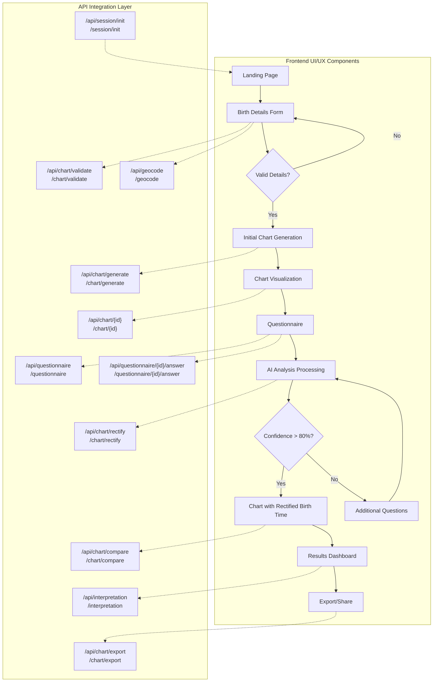
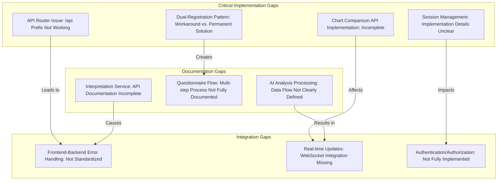

# System Patterns

## Form Validation Patterns
1. **Real-time Validation**
   - Immediate validation on input/change events
   - Deferred validation on blur events
   - Error state management through React state
   - HTML5 input validation handling

2. **Error Handling**
   - Role-based error messages for accessibility
   - Consistent error message styling
   - Field-level error state management
   - Form-level validation state

3. **Input Event Handling**
   - Combined input/change event handling for HTML5 inputs
   - Touch state tracking for validation timing
   - Blur event handling for validation confirmation

## Type Management Patterns
1. **Union Types for Flexibility**
   - Handling properties that can be multiple types (e.g., `ascendant` as number or object)
   - Type guards for conditional rendering
   - Type narrowing in component logic
   - Explicit return type annotations

2. **Nested Object Structures**
   - Proper nesting for complex data (e.g., `coordinates` within `BirthDetails`)
   - Consistent access patterns with optional chaining
   - Default values for potentially undefined properties
   - Immutable state updates preserving structure

3. **Interface Consistency**
   - Component prop interfaces with required vs optional properties
   - API communication interfaces matching backend expectations
   - Consistent naming conventions across related interfaces
   - Documentation comments for complex types

4. **Mock Data Typing**
   - Complete mock objects matching interface requirements
   - Type validation in test data
   - Mock service responses with correct types
   - Test utilities with proper generic types

## Testing Patterns
1. **Form Testing**
   - Mock event simulation
   - HTML5 input behavior handling
   - Async validation testing
   - Error message verification
   - Type-safe mock data

2. **Component Testing**
   - Isolated component testing
   - Mock service dependencies
   - Event handling verification
   - State management testing
   - Type-checked test assertions

3. **Selector Specificity**
   - Role-based selectors for accessibility
   - Text content with additional qualifiers
   - Class-based selectors for component instances
   - Container queries for component boundaries
   - HTML structure-aware selection

## UI Component Patterns
1. **Progressive Loading**
   - Texture loading with quality levels
   - Fallback handling
   - Cache management
   - Resource cleanup

2. **Form Components**
   - Controlled inputs
   - Validation feedback
   - Loading state handling
   - Error boundary implementation
   - Type-safe prop interfaces

3. **Chart Visualization**
   - WebGL rendering with fallbacks
   - Interactive elements with event handling
   - Data transformation with type safety
   - Conditional rendering based on data presence
   - Aspect ratio management

## Architecture Patterns
1. **Component Architecture**
   - Functional components with hooks
   - Props interface definitions
   - Type-safe state management
   - Clean separation of concerns
   - Container/presentation component pattern

2. **API Communication**
   - Type-safe request/response handling
   - Error handling with typed error responses
   - Loading state management
   - Retry mechanisms
   - Cancel token support

3. **State Management**
   - Local component state with typed useState
   - Reducer pattern with typed actions
   - Context API with typed providers
   - Immutable state updates
   - State normalization for complex data

## Type Safety Patterns
1. **TypeScript Configuration**
   - Strict mode enabled
   - Module resolution strategies
   - Path aliases for clean imports
   - Declaration file management
   - Incremental compilation

2. **Runtime Type Checking**
   - Validation at API boundaries
   - Defensive programming with type guards
   - Graceful fallbacks for unexpected types
   - JSON schema validation
   - Error reporting with type information

## Architecture Overview
1. Frontend Architecture
   - Next.js for server-side rendering and routing
   - React components with TypeScript
   - Form state management with local state and validation
   - Service layer for external API interactions

2. Component Patterns
   - Controlled form components
   - Custom hooks for form validation
   - Error boundary components
   - Loading state management
   - Geocoding service integration

3. Testing Patterns
   - Jest for unit testing
   - React Testing Library for component testing
   - Mock service workers for API mocking
   - Test utilities for common operations

## Design Patterns

### Form Components
1. BirthDetailsForm
   ```typescript
   interface FormState {
     date: string;
     time: string;
     birthPlace: string;
     latitude?: number;
     longitude?: number;
     timezone?: string;
   }

   interface ValidationErrors {
     date?: string;
     time?: string;
     birthPlace?: string;
   }
   ```

2. LifeEventsQuestionnaire
   ```typescript
   interface LifeEventQuestion {
     id: string;
     question: string;
     category: 'career' | 'relationships' | 'health' | 'other';
   }

   interface QuestionnaireState {
     answers: Record<string, boolean>;
     isValid: boolean;
   }
   ```

### Service Layer
1. Geocoding Service
   ```typescript
   interface GeocodingResult {
     latitude: number;
     longitude: number;
     timezone: string;
   }

   async function geocodeBirthPlace(place: string): Promise<GeocodingResult>
   ```

### Testing Patterns
1. Component Testing
   ```typescript
   describe('Component', () => {
     beforeEach(() => {
       jest.clearAllMocks();
     });

     it('test case', async () => {
       render(<Component {...props} />);
       await userEvent.type(...);
       await waitFor(() => {
         expect(...).toBeInTheDocument();
       });
     });
   });
   ```

2. Mock Patterns
   ```typescript
   jest.mock('@/services/geocoding', () => ({
     geocodeBirthPlace: jest.fn().mockResolvedValue({
       latitude: 51.5074,
       longitude: -0.1278,
       timezone: 'Europe/London'
     })
   }));
   ```

## State Management
1. Form State
   - Local state with useState
   - Validation state management
   - Error state handling
   - Loading state tracking

2. Service State
   - API call states
   - Error handling
   - Response caching
   - Loading indicators

## Error Handling
1. Form Validation
   - Real-time validation
   - Field-level error messages
   - Form-level validation
   - Submit validation

2. Service Errors
   - API error handling
   - Network error recovery
   - Graceful degradation
   - User feedback

## Performance Patterns
1. Form Optimization
   - Debounced validation
   - Lazy loading of components
   - Memoization of expensive computations
   - Efficient state updates

2. API Optimization
   - Request caching
   - Response compression
   - Batch operations
   - Connection pooling

3. Visualization Optimization
   - Progressive texture loading
   - WebGL context management
   - Memory optimization
   - Device capability adaptation

## Security Patterns
1. Input Validation
   - Sanitization of user input
   - Type checking
   - Range validation
   - Format verification

2. API Security
   - Rate limiting
   - CORS configuration
   - Authentication
   - Authorization

## Deployment Patterns
1. Containerization
   - Multi-stage builds
   - Environment configuration
   - Health checks
   - Resource management

2. CI/CD
   - Automated testing
   - Code validation
   - Security scanning
   - Preview deployments

## Monitoring Patterns
1. Performance Monitoring
   - Response time tracking
   - Resource utilization
   - Error rates
   - User metrics

2. Error Tracking
   - Error logging
   - Stack traces
   - User context
   - Error categorization

## Documentation Patterns
1. Code Documentation
   - JSDoc comments
   - Type definitions
   - Interface documentation
   - Usage examples

2. API Documentation
   - OpenAPI schema
   - Endpoint descriptions
   - Request/response examples
   - Error documentation

## API Endpoint Integration Architecture

### API Integration Patterns

The application uses several key patterns for API integration:

#### 1. Dual-Registration Pattern

The API uses a dual-registration pattern to ensure compatibility and flexibility:

- **Primary Endpoints**: All endpoints are registered with `/api/` prefix
  - Chart-related endpoints follow nested routing: `/api/chart/[endpoint]`
  - Other service endpoints follow flat routing: `/api/[endpoint]`

- **Alternative Endpoints**: All endpoints are also registered without `/api/` prefix
  - Chart-related endpoints: `/chart/[endpoint]`
  - Other service endpoints: `/[endpoint]`

This pattern is implemented in FastAPI through duplicate router registration:

```python
# Register with /api prefix (primary endpoints)
app.include_router(health_router, prefix=API_PREFIX)
app.include_router(validate_router, prefix=f"{API_PREFIX}/chart")

# Register at root level (alternative endpoints)
app.include_router(health_router)
app.include_router(validate_router, prefix="/chart")
```

#### 2. UI-to-API Integration Flow

The application follows a specific flow pattern for component-to-API integration:



#### 3. Standardized Request/Response Pattern

All API endpoints follow a consistent request/response pattern:

1. **Success Responses**:
   - HTTP status codes: 200 for success, 201 for creation
   - JSON structure with consistent field naming
   - Metadata when applicable (timestamps, pagination info)

2. **Error Responses**:
   - Appropriate HTTP status code (400, 404, 500)
   - Consistent error format:
     ```json
     {
       "error": {
         "code": "ERROR_CODE",
         "message": "Human-readable error message",
         "details": { /* Additional error details */ }
       }
     }
     ```

### Integration Gap Patterns

Current integration has identified several architectural gaps:



The dual-registration pattern is currently a workaround rather than an architectural choice. Future iterations should address these gaps to create a more coherent API architecture.

# System Architecture and Design Patterns

## System Architecture Overview

The Birth Time Rectifier application follows a modern, microservices-inspired architecture with clear separation of concerns. The system is divided into the following main components:

```
┌─────────────────┐     ┌─────────────────┐     ┌─────────────────┐
│                 │     │                 │     │                 │
│  Frontend UI    │────▶│  API Layer      │────▶│  Backend        │
│  (React/TS)     │     │  (FastAPI)      │     │  Services       │
│                 │     │                 │     │                 │
└─────────────────┘     └─────────────────┘     └─────────────────┘
        │                       │                       │
        │                       │                       │
        ▼                       ▼                       ▼
┌─────────────────┐     ┌─────────────────┐     ┌─────────────────┐
│                 │     │                 │     │                 │
│  Client-side    │     │  API Gateway    │     │  Database       │
│  State          │     │  & Routing      │     │  (PostgreSQL)   │
│                 │     │                 │     │                 │
└─────────────────┘     └─────────────────┘     └─────────────────┘
                                │
                                │
                                ▼
                        ┌─────────────────┐
                        │                 │
                        │  External       │
                        │  Services       │
                        │                 │
                        └─────────────────┘
```

### Core Components

1. **Frontend UI (React/TypeScript)**
   - Progressive web application with responsive design
   - Component-based architecture with reusable UI elements
   - Client-side routing for seamless user experience
   - Form handling with validation
   - Visualization components for astrological charts

2. **API Layer (FastAPI)**
   - RESTful API design with standardized endpoints
   - Dual-registration pattern for backward compatibility
   - Input validation and error handling
   - Authentication and authorization
   - Endpoint grouping by functional domain

3. **Backend Services**
   - Specialized service modules for different functions
   - Computational engine for astrological calculations
   - AI/ML models for birth time rectification
   - Data processing and transformation
   - Asynchronous task processing

4. **Data Persistence (PostgreSQL)**
   - Relational database for structured data
   - Session storage
   - User data management
   - Chart data storage
   - Rectification results

5. **External Service Integration**
   - Geocoding services
   - Time zone database
   - Ephemeris data sources
   - Authentication providers
   - Email/notification services

## Key Design Patterns

### 1. Repository Pattern

Used for data access abstraction to decouple business logic from data access logic.

```python
# Repository pattern implementation
class ChartRepository:
    def __init__(self, db_session):
        self.db_session = db_session

    async def get_by_id(self, chart_id: str) -> Chart:
        # Database access logic
        return await self.db_session.query(ChartModel).filter(ChartModel.id == chart_id).first()

    async def save(self, chart: Chart) -> str:
        # Save logic
        chart_model = ChartModel.from_domain(chart)
        self.db_session.add(chart_model)
        await self.db_session.commit()
        return chart_model.id
```

### 2. Service Layer Pattern

Encapsulates business logic in service classes, separate from controllers and data access.

```python
# Service layer pattern
class RectificationService:
    def __init__(self, chart_repo, event_processor):
        self.chart_repo = chart_repo
        self.event_processor = event_processor

    async def rectify_birth_time(self, chart_id: str, life_events: List[LifeEvent]) -> RectificationResult:
        # Business logic for rectification
        chart = await self.chart_repo.get_by_id(chart_id)
        processed_events = self.event_processor.process(life_events)
        result = self.calculate_rectification(chart, processed_events)
        return result
```

### 3. Factory Pattern

Used for creating complex objects without specifying the exact class.

```python
# Factory pattern for chart creation
class ChartFactory:
    @staticmethod
    def create_chart(birth_details: BirthDetails, options: ChartOptions) -> Chart:
        if options.chart_type == "tropical":
            return TropicalChart(birth_details)
        elif options.chart_type == "sidereal":
            return SiderealChart(birth_details)
        else:
            raise ValueError(f"Unsupported chart type: {options.chart_type}")
```

### 4. Strategy Pattern

Enables selecting an algorithm at runtime based on the context.

```python
# Strategy pattern for rectification methods
class RectificationStrategy(ABC):
    @abstractmethod
    def rectify(self, chart: Chart, events: List[LifeEvent]) -> RectificationResult:
        pass

class EventBasedRectification(RectificationStrategy):
    def rectify(self, chart: Chart, events: List[LifeEvent]) -> RectificationResult:
        # Implementation for event-based rectification
        return result

class TransitBasedRectification(RectificationStrategy):
    def rectify(self, chart: Chart, events: List[LifeEvent]) -> RectificationResult:
        # Implementation for transit-based rectification
        return result
```

### 5. Observer Pattern

Used for notifications and event handling.

```python
# Observer pattern for progress tracking
class RectificationProgressSubject:
    def __init__(self):
        self._observers = []

    def attach(self, observer):
        self._observers.append(observer)

    def detach(self, observer):
        self._observers.remove(observer)

    def notify(self, progress: float, message: str):
        for observer in self._observers:
            observer.update(progress, message)
```

### 6. Command Pattern

Encapsulates a request as an object, allowing parameterization of clients with different requests.

```python
# Command pattern for chart operations
class ChartCommand(ABC):
    @abstractmethod
    def execute(self) -> Any:
        pass

class GenerateChartCommand(ChartCommand):
    def __init__(self, birth_details: BirthDetails, options: ChartOptions, chart_service: ChartService):
        self.birth_details = birth_details
        self.options = options
        self.chart_service = chart_service

    def execute(self) -> Chart:
        return self.chart_service.generate_chart(self.birth_details, self.options)
```

### 7. Dependency Injection

Used throughout the system for loose coupling and testability.

```python
# Dependency injection with FastAPI
def get_chart_service(
    chart_repo: ChartRepository = Depends(get_chart_repository),
    calculation_engine: CalculationEngine = Depends(get_calculation_engine)
) -> ChartService:
    return ChartService(chart_repo, calculation_engine)

@router.post("/generate", response_model=ChartResponse)
async def generate_chart(
    request: ChartRequest,
    chart_service: ChartService = Depends(get_chart_service)
) -> ChartResponse:
    chart = await chart_service.generate_chart(request.birth_details, request.options)
    return ChartResponse.from_domain(chart)
```

## API Design Decisions

### 1. Dual-Registration Pattern

The system implements a dual-registration pattern for API endpoints to ensure backward compatibility:

```python
# Primary API routes (with /api prefix)
app.include_router(chart_router, prefix=f"{API_PREFIX}/chart")
app.include_router(geocode_router, prefix=API_PREFIX)

# Alternative routes (without /api prefix)
app.include_router(chart_router, prefix="/chart")
app.include_router(geocode_router)
```

**Rationale:** This pattern allows existing clients to continue using the direct endpoints while new clients can use the standardized `/api` prefixed endpoints. This dual approach is currently implemented as a workaround due to routing issues with the `/api` prefix but will be consolidated once the routing issues are resolved.

### 2. Standardized Response Format

All API responses follow a consistent structure:

```python
# Success response
{
  "data": {
    # Actual payload here
  },
  "meta": {
    "timestamp": "2023-06-15T12:34:56Z",
    # Other metadata
  }
}

# Error response
{
  "error": {
    "code": "ERROR_CODE",
    "message": "Human-readable error message",
    "details": { /* Additional error details */ }
  }
}
```

**Rationale:** Consistent response formats make client-side handling more predictable and improve developer experience.

### 3. Router-Based Organization

API endpoints are organized into domain-specific routers:

```
api/
├── routers/
│   ├── health.py
│   ├── validate.py
│   ├── geocode.py
│   ├── chart.py
│   ├── questionnaire.py
│   ├── rectify.py
│   └── export.py
```

**Rationale:** This organization improves maintainability by grouping related endpoints and separating concerns.

## Domain Model

The core domain model revolves around astrological charts and birth time rectification:

```
┌───────────────┐       ┌───────────────┐       ┌───────────────┐
│               │       │               │       │               │
│ BirthDetails  │──────▶│   Chart       │──────▶│ Rectification │
│               │       │               │       │               │
└───────────────┘       └───────────────┘       └───────────────┘
        │                       │                       │
        │                       │                       │
        ▼                       ▼                       ▼
┌───────────────┐       ┌───────────────┐       ┌───────────────┐
│               │       │               │       │               │
│   Location    │       │   Planet      │       │   LifeEvent   │
│               │       │               │       │               │
└───────────────┘       └───────────────┘       └───────────────┘
```

### Key Domain Objects

1. **BirthDetails**: Contains birth date, time, and location information
2. **Chart**: Represents an astrological chart with planets, houses, aspects
3. **Rectification**: The process and results of birth time correction
4. **Location**: Geographic coordinates and timezone information
5. **Planet**: Planetary positions in the chart
6. **LifeEvent**: Significant events in a person's life used for rectification

## Technical Debt and Architectural Challenges

### 1. API Router Issue

**Problem**: The `/api` prefix routing is not working correctly, requiring the dual-registration workaround.

**Impact**: Code duplication, potential inconsistencies, maintenance overhead.

**Solution**: Investigate and fix the FastAPI router configuration to properly handle the `/api` prefix.

### 2. Session Management

**Problem**: Session management is not fully implemented.

**Impact**: Limited user session persistence, potential authentication issues.

**Solution**: Design and implement a comprehensive session management system.

### 3. Authentication/Authorization

**Problem**: Authentication and authorization are not fully implemented.

**Impact**: Limited security controls, potential for unauthorized access.

**Solution**: Implement JWT-based authentication with proper permission management.

### 4. Chart Comparison Service

**Problem**: The Chart Comparison Service is referenced but not fully implemented.

**Impact**: Limited ability to compare original and rectified charts.

**Solution**: Complete the implementation with proper data structures and algorithms.

### 5. Real-time Updates

**Problem**: No WebSocket implementation for long-running processes.

**Impact**: Limited real-time feedback during processing.

**Solution**: Implement WebSocket support for progress updates.

## Future Architectural Improvements

1. **API Versioning**: Add version prefixes (e.g., `/api/v1/chart/generate`) for better API lifecycle management.

2. **Microservices**: Consider breaking down the monolithic backend into true microservices for better scaling and isolation.

3. **Event Sourcing**: Implement event sourcing for better tracking of state changes and auditability.

4. **CQRS Pattern**: Separate read and write operations for improved performance and scalability.

5. **GraphQL**: Consider adding GraphQL support for more flexible data querying.

6. **Edge Caching**: Implement CDN and edge caching for improved global performance.
