# Sequence Diagram Implementation Guide

## Sequence Diagram

```mermaid
sequenceDiagram
    participant User
    participant FE as Frontend
    participant API as API Layer
    participant BE as Backend Services
    participant DB as Database

    %% Initial Flow - Session Initialization
    Note over User,DB: ❌ Missing: Session Management
    User->>FE: Visit application
    FE->>API: Should call: GET /api/session/init
    API--xFE: Missing endpoint implementation
    Note over FE,API: No session management<br/>currently implemented

    %% Birth Details Entry and Validation
    User->>FE: Enter birth location
    FE->>API: POST /api/geocode<br/>{query: "New York, USA"}
    API->>BE: Process location request
    BE->>DB: Query location database
    DB-->>BE: Return coordinates
    BE-->>API: Location data
    API-->>FE: {results: [{id: "loc_123", name: "New York City", country: "United States", latitude: 40.7128, longitude: -74.0060, timezone: "America/New_York"}]}

    User->>FE: Enter birth date and time
    FE->>API: POST /api/chart/validate<br/>{birth_date: "1990-01-15", birth_time: "14:30:00", latitude: 40.7128, longitude: -74.0060, timezone: "America/New_York"}
    API->>BE: Validate birth details
    BE-->>API: Validation result
    API-->>FE: {valid: true, errors: []}

    %% Chart Generation
    User->>FE: Request chart generation
    FE->>API: POST /api/chart/generate<br/>{birth_date: "1990-01-15", birth_time: "14:30:00", latitude: 40.7128, longitude: -74.0060, timezone: "America/New_York", options: {house_system: "placidus"}}
    API->>BE: Calculate astrological chart
    BE->>DB: Store chart data
    DB-->>BE: Return chart ID
    BE-->>API: Chart data
    API-->>FE: {chart_id: "chrt_123456", ascendant: {sign: "Virgo", degree: 15.32}, planets: [...], houses: [...]}

    %% Chart Visualization
    FE->>API: GET /api/chart/chrt_123456
    API->>BE: Retrieve chart
    BE->>DB: Query chart data
    DB-->>BE: Chart details
    BE-->>API: Complete chart data
    API-->>FE: {chart_id: "chrt_123456", ascendant: {sign: "Virgo", degree: 15.32}, planets: [...], houses: [...], aspects: [...]}

    %% Questionnaire
    User->>FE: Navigate to questionnaire
    FE->>API: GET /api/questionnaire
    API->>BE: Generate questionnaire
    BE-->>API: Questionnaire data
    API-->>FE: {questions: [{id: "q_001", text: "Have you experienced any major career changes?", type: "yes_no"}]}

    User->>FE: Answer question (Yes)
    FE->>API: POST /api/questionnaire/q_001/answer<br/>{question_id: "q_001", answer: "yes"}
    API->>BE: Process answer
    BE->>DB: Store answer
    BE-->>API: Next question
    API-->>FE: {status: "accepted", next_question_url: "/api/questionnaire/q_002"}

    User->>FE: Answer question (Date)
    FE->>API: POST /api/questionnaire/q_002/answer<br/>{question_id: "q_002", answer: {date: "2018-03-15", additional_notes: "Career change"}}
    API->>BE: Process answer
    BE->>DB: Store answer
    BE-->>API: Next question
    API-->>FE: {status: "accepted", next_question_url: "/api/questionnaire/q_003"}

    User->>FE: Complete questionnaire
    FE->>API: POST /api/questionnaire/complete<br/>{rectification_id: "rect_123456"}
    API->>BE: Finalize questionnaire
    BE-->>API: Completion status
    API-->>FE: {status: "processing", estimated_completion_time: "2023-06-15T13:30:00Z"}

    %% Birth Time Rectification
    FE->>API: POST /api/chart/rectify<br/>{chart_id: "chrt_123456", answers: [...], birth_time_range: {min_hours: 13, min_minutes: 0, max_hours: 16, max_minutes: 0}}
    API->>BE: Perform birth time rectification
    BE->>DB: Process answers and chart data
    Note over BE: AI analysis runs to<br/>determine optimal birth time
    DB-->>BE: Return analysis results
    BE-->>API: Rectification result
    API-->>FE: {rectification_id: "rect_123456", confidence_score: 87.5, original_birth_time: "14:30:00", rectified_birth_time: "15:12:00", rectified_chart_id: "chrt_234567"}

    %% Chart Comparison
    Note over User,DB: ❌ Incomplete Implementation: Chart Comparison
    FE->>API: GET /api/chart/compare?chart1_id=chrt_123456&chart2_id=chrt_234567
    API->>BE: Compare charts
    BE->>DB: Retrieve both charts
    DB-->>BE: Charts data
    BE-->>API: Comparison data
    API-->>FE: {differences: [{type: "ascendant_shift", chart1_position: {sign: "Virgo", degree: 15.32}, chart2_position: {sign: "Virgo", degree: 18.75}}, ...]}

    %% Interpretation
    Note over User,DB: ❌ Incomplete Implementation: Interpretation Service
    FE->>API: GET /api/interpretation?chart_id=chrt_234567
    API->>BE: Generate interpretation
    BE->>DB: Retrieve chart data
    DB-->>BE: Chart details
    BE-->>API: Personalized insights
    API-->>FE: {insights: [...]}

    %% Export Chart
    User->>FE: Request chart export
    FE->>API: POST /api/chart/export<br/>{chart_id: "chrt_234567", format: "pdf", include_interpretation: true}
    API->>BE: Generate export
    BE->>DB: Retrieve chart data
    DB-->>BE: Chart details
    BE-->>API: Export data
    API-->>FE: {export_id: "exp_123456", status: "processing", download_url: "/api/export/exp_123456/download"}

    FE->>API: GET /api/export/exp_123456/download
    API->>BE: Retrieve export
    BE-->>API: Export file
    API-->>FE: Binary file data (PDF)
    FE-->>User: Display downloadable chart
```

## Sequence Overview

The sequence diagram illustrates the complete flow of the Birth Time Rectifier application, from initial session creation through birth time rectification. It highlights several missing or incomplete components that need to be implemented.

## Component Interaction Map

The sequence diagram involves the following components, with their responsibilities and interactions:

### Frontend (FE)
- Initiates session on application load
- Collects user input for birth details
- Sends API requests for geocoding, validation, chart generation, and rectification
- Establishes WebSocket connection for real-time updates
- Renders chart and rectification results

### API Layer (API)
- Routes requests to appropriate backend services
- Validates session and authentication
- Returns formatted responses
- Establishes WebSocket connections

### Backend Services (BE)
- **Auth Service**: Creates and manages user sessions, validates authentication tokens
- **Chart Service**: Processes geocoding requests, validates birth details, generates charts
- **Rectification Service**: Processes birth time rectification, sends progress updates
- **Interpretation Service**: Generates chart interpretations and insights

### Database (DB)
- Stores session data
- Persists user information
- Stores chart and rectification data
- Manages location data

## Detailed Implementation Steps

To implement this sequence diagram correctly, follow these detailed steps:

### 1. Session Initialization

1. **Create Session Service**
   - Implement `SessionService` in `ai_service/services/session_service.py`
   - Add Redis integration for session storage
   - Implement session creation, retrieval, and validation methods

2. **Add Session Initialization Endpoint**
   - Create `/api/session/init` endpoint in `ai_service/api/routers/session.py`
   - Generate unique session ID
   - Store initial session data in Redis
   - Return session token to frontend

3. **Frontend Session Integration**
   - Add session initialization on application load
   - Store session token in frontend state
   - Include session token in all subsequent API requests

### 2. Geocoding Implementation

1. **Create Geocoding Service**
   - Implement `GeocodingService` in `ai_service/services/geocoding_service.py`
   - Add integration with geocoding provider (e.g., Google Maps, OpenStreetMap)
   - Implement location search and retrieval methods

2. **Add Geocoding Endpoint**
   - Create `/api/geocode` endpoint in `ai_service/api/routers/geocoding.py`
   - Accept location query parameter
   - Return coordinates, timezone, and location details

3. **Frontend Geocoding Integration**
   - Implement location search in birth details form
   - Display location suggestions as user types
   - Store selected location data for chart generation

### 3. Chart Validation

1. **Create Validation Service**
   - Implement validation logic in `ai_service/services/chart_service.py`
   - Add methods to validate birth date, time, and location

2. **Add Validation Endpoint**
   - Create `/api/chart/validate` endpoint in `ai_service/api/routers/chart.py`
   - Accept birth details parameters
   - Return validation result with any errors

3. **Frontend Validation Integration**
   - Add client-side validation with API validation
   - Display validation errors to user
   - Enable chart generation only for valid details

### 4. Chart Generation

1. **Enhance Chart Service**
   - Implement chart calculation logic in `ai_service/services/chart_service.py`
   - Add methods to calculate planetary positions, house cusps, and aspects
   - Create data models for chart components

2. **Add Chart Generation Endpoint**
   - Create `/api/chart/generate` endpoint in `ai_service/api/routers/chart.py`
   - Accept birth details and options parameters
   - Validate session and user authentication
   - Return complete chart data

3. **Frontend Chart Integration**
   - Implement chart visualization component
   - Display planetary positions, houses, and aspects
   - Add interactive elements for chart exploration

### 5. Rectification Process

1. **Create Rectification Service**
   - Implement `RectificationService` in `ai_service/services/rectification_service.py`
   - Add birth time rectification algorithms
   - Implement progress tracking and event handling

2. **Add Rectification Endpoint**
   - Create `/api/chart/rectify` endpoint in `ai_service/api/routers/chart.py`
   - Accept chart ID and options parameters
   - Validate session and user authentication
   - Return rectification result with confidence score

3. **Add WebSocket Support**
   - Implement WebSocket endpoint in `ai_service/api/websockets.py`
   - Create connection manager for client sessions
   - Add progress notification system

4. **Frontend Rectification Integration**
   - Implement rectification request UI
   - Establish WebSocket connection for progress updates
   - Display progress indicators during processing
   - Show rectified chart with confidence score

### 6. Chart Comparison

1. **Create Comparison Service**
   - Implement chart comparison logic in `ai_service/services/chart_service.py`
   - Add methods to detect differences between charts
   - Create data models for comparison results

2. **Add Comparison Endpoint**
   - Create `/api/chart/compare` endpoint in `ai_service/api/routers/chart.py`
   - Accept chart IDs for comparison
   - Return detailed comparison results

3. **Frontend Comparison Integration**
   - Implement comparison visualization
   - Highlight differences between original and rectified charts
   - Add toggle options for different comparison views

### 7. Interpretation Service

1. **Create Interpretation Service**
   - Implement `InterpretationService` in `ai_service/services/interpretation_service.py`
   - Add interpretation logic for planetary positions, aspects, and houses
   - Create synthesis engine for personalized interpretations

2. **Add Interpretation Endpoint**
   - Create `/api/interpretation` endpoint in `ai_service/api/routers/interpretation.py`
   - Accept chart ID parameter
   - Return detailed interpretation data

3. **Frontend Interpretation Integration**
   - Implement interpretation display component
   - Show personalized interpretations for chart elements
   - Add expandable sections for detailed information

## Testing the Sequence Flow

When testing the sequence flow:

1. **End-to-End Testing**
   - Create tests that follow the exact sequence in the diagram
   - Verify each response matches the expected format
   - Test error handling at each step

2. **Component Testing**
   - Test each service independently
   - Verify correct behavior with valid and invalid inputs
   - Test edge cases for each component

3. **Integration Testing**
   - Test interactions between components
   - Verify data flows correctly between services
   - Test authentication and session validation

4. **Performance Testing**
   - Measure response times for chart generation and rectification
   - Test system under load to ensure stability
   - Optimize bottlenecks in the sequence
