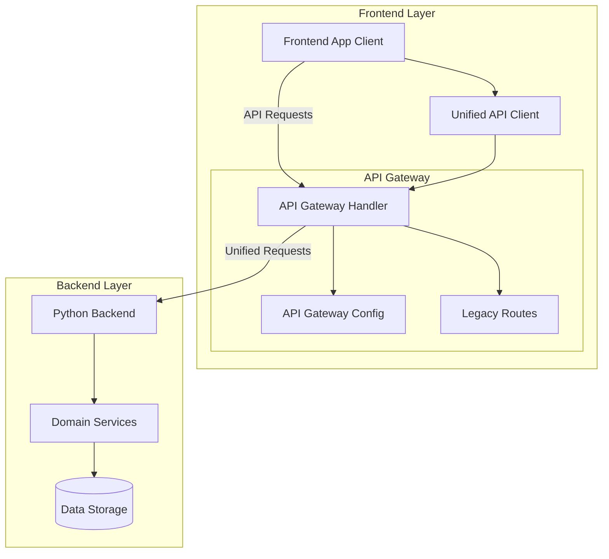
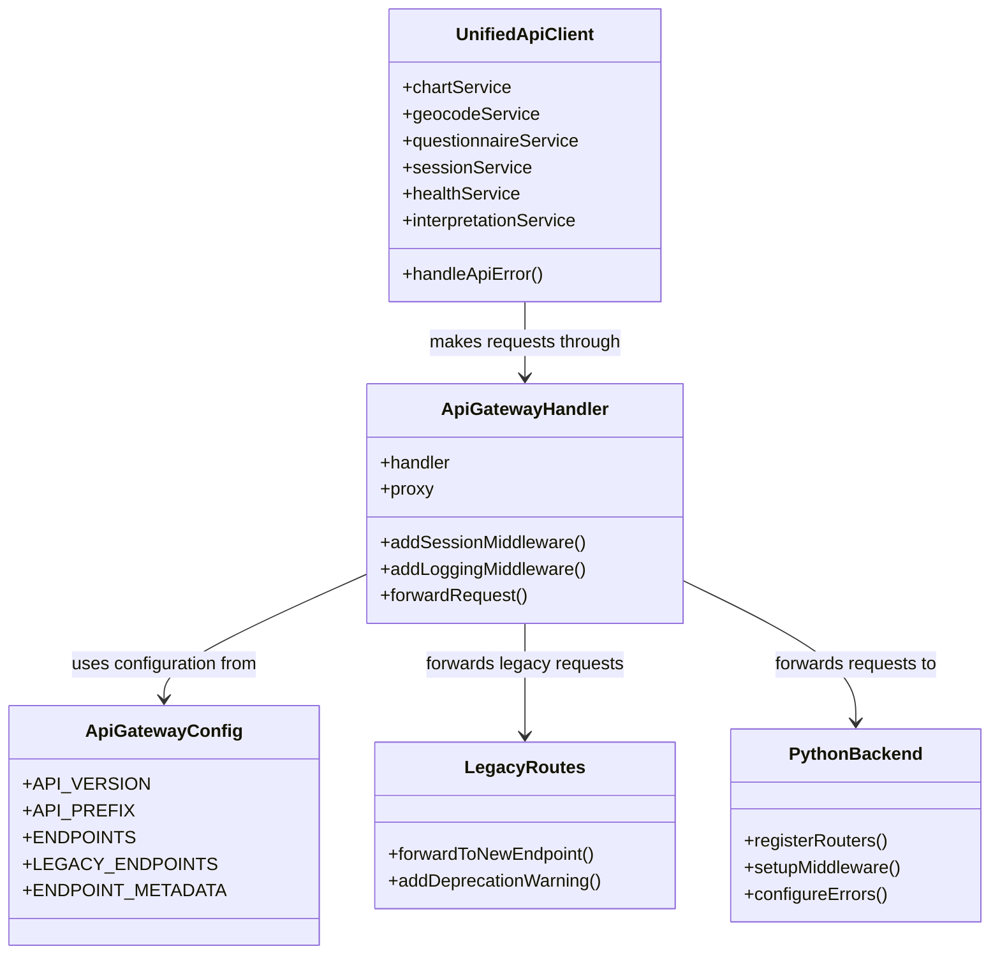
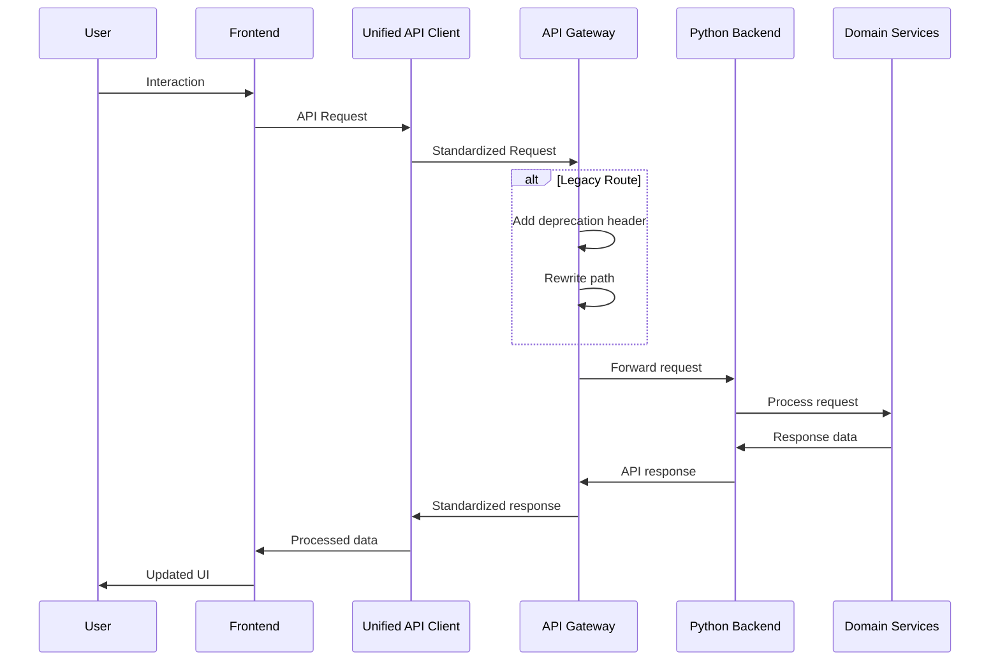

# Unified API Gateway Architecture

## Architecture Diagram

## Component Structure

## Data Flow Diagram

## Key Components

### 1. Unified API Client (`src/utils/unifiedApiClient.js`)

The Unified API Client provides a centralized way for the frontend application to interact with all API endpoints:

- **Service Objects**: Domain-specific methods for different API areas (chart, geocode, etc.)
- **Error Handling**: Standardized error processing and retry logic
- **Request Interceptors**: Add session tokens and other headers
- **Response Transformation**: Convert raw API responses to expected formats

### 2. API Gateway Handler (`src/pages/api/[[...path]].js`)

The API Gateway Handler is a catch-all Next.js API route that processes all API requests:

- **Proxy Middleware**: Forward requests to the Python backend
- **Path Rewriting**: Convert frontend paths to backend paths
- **Session Management**: Track and validate sessions
- **Error Handling**: Standardized error responses
- **CORS Support**: Proper cross-origin resource sharing

### 3. API Gateway Configuration (`src/config/apiGateway.js`)

The configuration file defines all API endpoints and metadata:

- **Endpoint Registry**: All available endpoints with versioning
- **Legacy Mappings**: Support for backward compatibility
- **API Metadata**: Documentation and client generation info

### 4. Simplified Python Backend (`ai_service/main_simplified.py`)

The Python backend is streamlined to use consistent router registration:

- **Unified Prefix**: All endpoints use `/api` prefix
- **Simplified Registration**: No duplicate router registration
- **Standardized Error Handling**: Consistent error format

### 5. Legacy Support Routes

Transition routes maintain backward compatibility while encouraging migration:

- **Deprecation Notices**: Warning headers for legacy endpoints
- **Request Forwarding**: Redirect to new endpoints
- **Graceful Degradation**: Fallback options for changes

## Benefits of the Unified Architecture

1. **Reduced Code Duplication**
   - Single implementation of each endpoint
   - Centralized configuration and documentation

2. **Consistent Error Handling**
   - Standardized error format across all endpoints
   - Unified retry and recovery logic

3. **Improved Maintainability**
   - Clear separation of concerns
   - Simplified routing structure

4. **Better Developer Experience**
   - Consistent API interface
   - Comprehensive documentation
   - Logical organization

5. **Enhanced Performance**
   - Optimized request handling
   - Reduced network hops

## Implementation Steps

The implementation of the unified API Gateway architecture follows this process:

1. **Create Core Infrastructure**
   - Implement unified API client
   - Create API Gateway configuration
   - Set up API Gateway handler

2. **Update Backend Routing**
   - Simplify Python backend router registration
   - Standardize on `/api` prefix

3. **Implement Transition Routes**
   - Create legacy endpoint handlers
   - Add deprecation warnings

4. **Test and Validate**
   - Verify all endpoints work through the gateway
   - Test backward compatibility

## Conclusion

The unified API Gateway architecture transforms the Birth Time Rectifier application from a dual-layer architecture with redundant implementations to a streamlined, unified approach. This architecture reduces code duplication, improves maintainability, and enhances the developer experience while maintaining backward compatibility.
