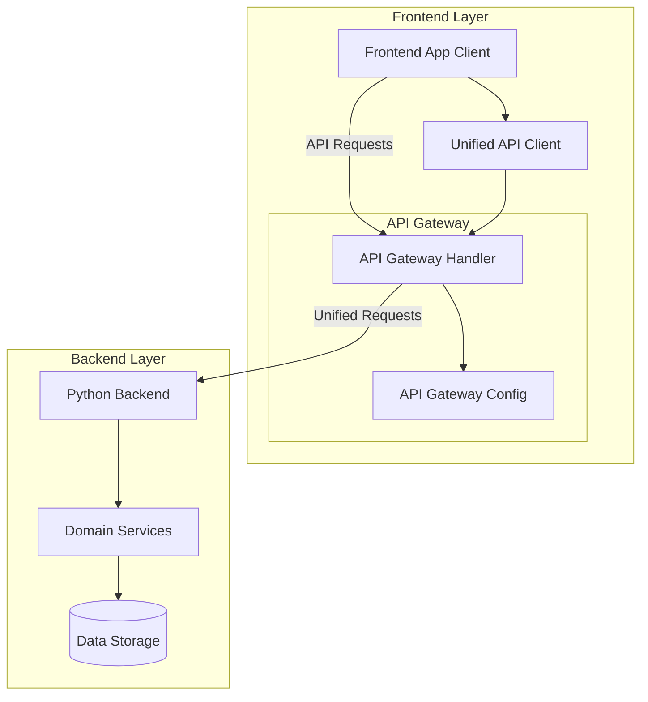
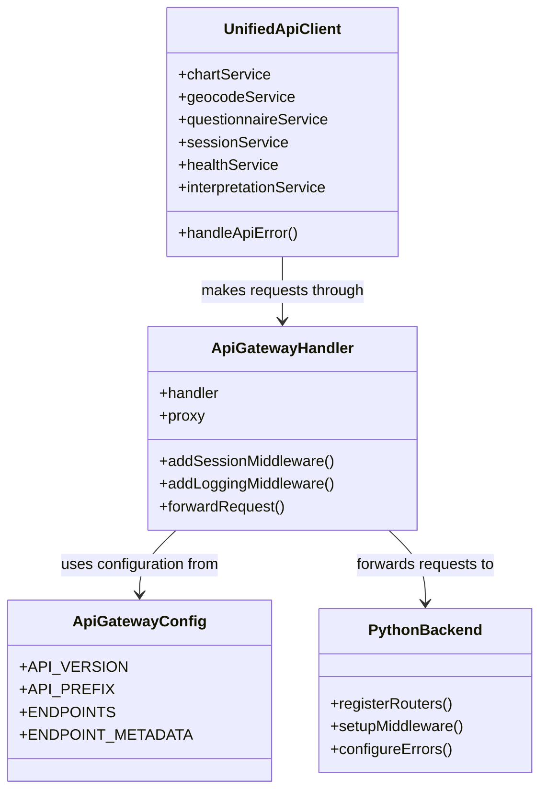
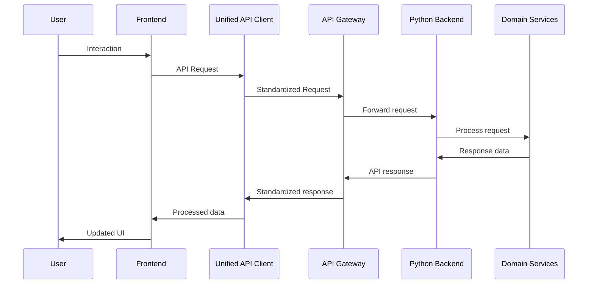

# Unified API Gateway Architecture

## Architecture Diagram

```mermaid
graph TD
    Client[Frontend App Client] --> |API Requests| Gateway[API Gateway Handler]
    Gateway --> |Unified Requests| Python[Python Backend]

    subgraph "Frontend Layer"
        Client
        APIClient[Unified API Client]
        Client --> APIClient
        APIClient --> Gateway

        subgraph "API Gateway"
            Gateway
            Config[API Gateway Config]
            Gateway --> Config
        end
    end

    subgraph "Backend Layer"
        Python
        Services[Domain Services]
        Python --> Services
        Services --> DB[(Data Storage)]
    end
```

## Component Structure

```mermaid
classDiagram
    class UnifiedApiClient {
        +chartService
        +geocodeService
        +questionnaireService
        +sessionService
        +healthService
        +interpretationService
        +handleApiError()
    }

    class ApiGatewayHandler {
        +handler
        +proxy
        +addSessionMiddleware()
        +addLoggingMiddleware()
        +forwardRequest()
    }

    class ApiGatewayConfig {
        +API_VERSION
        +API_PREFIX
        +ENDPOINTS
        +ENDPOINT_METADATA
    }

    class PythonBackend {
        +registerRouters()
        +setupMiddleware()
        +configureErrors()
    }

    UnifiedApiClient --> ApiGatewayHandler: makes requests through
    ApiGatewayHandler --> ApiGatewayConfig: uses configuration from
    ApiGatewayHandler --> PythonBackend: forwards requests to
```

## Data Flow Diagram

```mermaid
sequenceDiagram
    participant User
    participant Frontend
    participant APIClient as Unified API Client
    participant Gateway as API Gateway
    participant Python as Python Backend
    participant Services as Domain Services

    User->>Frontend: Interaction
    Frontend->>APIClient: API Request
    APIClient->>Gateway: Standardized Request
    Gateway->>Python: Forward request
    Python->>Services: Process request
    Services->>Python: Response data
    Python->>Gateway: API response
    Gateway->>APIClient: Standardized response
    APIClient->>Frontend: Processed data
    Frontend->>User: Updated UI
```

## Key Components

### 1. Unified API Client (`src/utils/unifiedApiClient.js`)

The Unified API Client provides a centralized way for the frontend application to interact with all API endpoints:

- **Service Objects**: Domain-specific methods for different API areas (chart, geocode, etc.)
- **Error Handling**: Standardized error processing and retry logic
- **Request Interceptors**: Add session tokens and other headers
- **Response Transformation**: Convert raw API responses to expected formats

### 2. API Gateway Handler (`src/pages/api/[[...path]].js`)

The API Gateway Handler is a catch-all Next.js API route that processes all API requests:

- **Proxy Middleware**: Forward requests to the Python backend
- **Session Management**: Track and validate sessions
- **Error Handling**: Standardized error responses
- **CORS Support**: Proper cross-origin resource sharing

### 3. API Gateway Configuration (`src/config/apiGateway.js`)

The configuration file defines all API endpoints and metadata:

- **Endpoint Registry**: All available endpoints with versioning
- **API Metadata**: Documentation and client generation info

### 4. Python Backend (`ai_service/unified_main.py`)

The Python backend is streamlined to use consistent router registration:

- **Unified Prefix**: All endpoints use `/api/v1` prefix
- **Simplified Registration**: Single router registration pattern
- **Standardized Error Handling**: Consistent error format
- **Middleware for 404s**: Returns appropriate error for non-v1 paths

## Benefits of the Unified Architecture

1. **Reduced Code Duplication**
   - Single implementation of each endpoint
   - Centralized configuration and documentation

2. **Consistent Error Handling**
   - Standardized error format across all endpoints
   - Unified retry and recovery logic

3. **Improved Maintainability**
   - Clear separation of concerns
   - Simplified routing structure

4. **Better Developer Experience**
   - Consistent API interface
   - Comprehensive documentation
   - Logical organization

5. **Enhanced Performance**
   - Optimized request handling
   - Reduced network hops

## Implementation Steps

The implementation of the unified API Gateway architecture follows this process:

1. **Create Core Infrastructure**
   - Implement unified API client
   - Create API Gateway configuration
   - Set up API Gateway handler

2. **Configure Backend Routing**
   - Implement Python backend router registration with `/api/v1` prefix
   - Add middleware to enforce v1 API paths

3. **Test and Validate**
   - Verify all endpoints work through the gateway
   - Ensure proper 404 handling for non-v1 paths

## Conclusion

The unified API Gateway architecture transforms the Birth Time Rectifier application to a streamlined, unified approach. This architecture reduces code duplication, improves maintainability, and enhances the developer experience by providing a consistent versioned API architecture.
