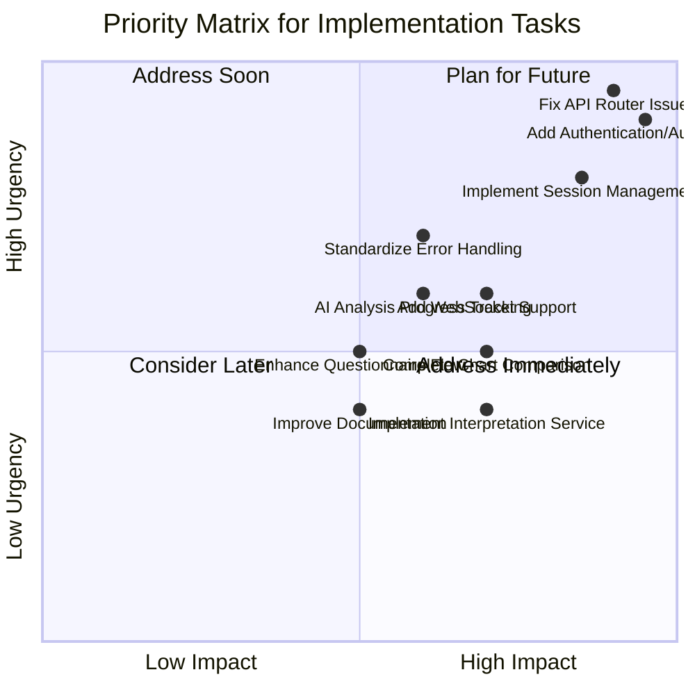
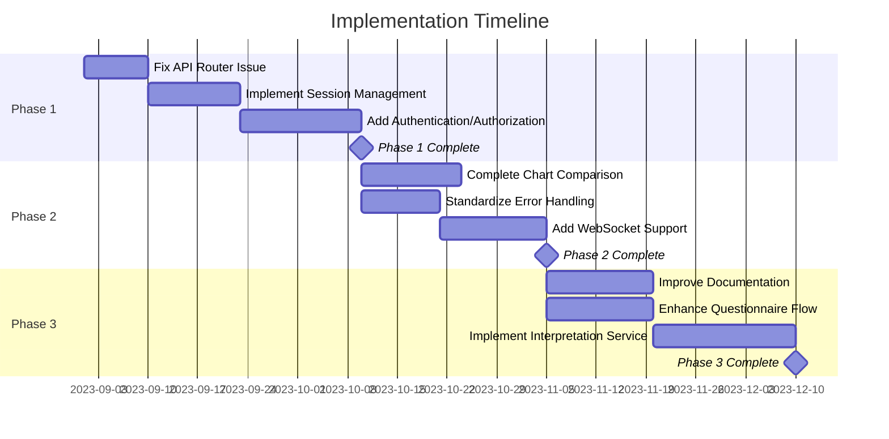

# API Implementation Guide

## Implementation Priority Matrix

## Implementation Strategy Overview

This implementation guide provides a comprehensive roadmap for addressing the API integration gaps and implementing the required functionality for the Birth Time Rectification application. The implementation is divided into three phases, focusing on critical infrastructure improvements, feature completion, and service enhancements.

### Core Principles

1. **Backward Compatibility**: Ensure existing clients continue to function during and after implementation
2. **Progressive Enhancement**: Implement features incrementally, with each step adding value
3. **Robust Testing**: Maintain comprehensive test coverage to prevent regressions
4. **Documentation**: Update documentation in parallel with implementation

## Detailed Implementation Phases

### Phase 1: Critical Infrastructure Improvements

#### 1.1 Fix API Router Issue

| Task | Description | Estimated Effort | Dependencies |
|------|-------------|------------------|--------------|
| 1.1.1 | Analyze current FastAPI router configuration | 1 day | None |
| 1.1.2 | Fix prefix handling in `main.py` | 1 day | 1.1.1 |
| 1.1.3 | Update router registration pattern | 2 days | 1.1.2 |
| 1.1.4 | Create API versioning system | 2 days | 1.1.3 |
| 1.1.5 | Test all endpoints with correct `/api` prefix | 2 days | 1.1.4 |
| 1.1.6 | Implement redirection for backward compatibility | 1 day | 1.1.5 |

**Implementation Details:**
- Create a `legacy_support_middleware` for proper path handling
- Implement path rewriting for legacy endpoints without the `/api` prefix
- Establish a versioned API routing structure (`/api/v1`)
- Remove duplicate router registrations to simplify code maintenance

**Expected Outcome:** Single endpoint registration with proper `/api` prefix handling.

#### 1.2 Implement Session Management

| Task | Description | Estimated Effort | Dependencies |
|------|-------------|------------------|--------------|
| 1.2.1 | Design session management architecture | 2 days | None |
| 1.2.2 | Create session initialization endpoint | 2 days | 1.2.1 |
| 1.2.3 | Implement session persistence mechanism | 3 days | 1.2.2 |
| 1.2.4 | Add session validation middleware | 2 days | 1.2.3 |
| 1.2.5 | Create session retrieval and update endpoints | 2 days | 1.2.4 |
| 1.2.6 | Integrate session management with frontend | 2 days | 1.2.5 |

**Implementation Details:**
- Create a core configuration system for application settings
- Implement a comprehensive session middleware with Redis support
- Add session router with endpoints for initialization, retrieval, and updates
- Integrate session management into the application flow
- Add fallback to in-memory storage when Redis is unavailable

**Expected Outcome:** Complete session management system with persistence and validation.

#### 1.3 Add Authentication/Authorization

| Task | Description | Estimated Effort | Dependencies |
|------|-------------|------------------|--------------|
| 1.3.1 | Design authentication system | 2 days | 1.2 completed |
| 1.3.2 | Implement user registration endpoint | 2 days | 1.3.1 |
| 1.3.3 | Create login/token generation endpoint | 2 days | 1.3.2 |
| 1.3.4 | Implement JWT middleware for protected routes | 3 days | 1.3.3 |
| 1.3.5 | Add permission management | 3 days | 1.3.4 |
| 1.3.6 | Create token refresh mechanism | 2 days | 1.3.5 |
| 1.3.7 | Integrate authentication with frontend | 3 days | 1.3.6 |

**Implementation Details:**
- Implement JWT-based authentication system
- Create role-based access control
- Add secure token handling with proper expiration
- Implement secure password storage using bcrypt

**Expected Outcome:** Secure authentication system with JWT tokens and appropriate permission controls.

### Phase 2: Feature Completion

#### 2.1 Complete Chart Comparison Service

| Task | Description | Estimated Effort | Dependencies |
|------|-------------|------------------|--------------|
| 2.1.1 | Design complete chart comparison data structure | 2 days | None |
| 2.1.2 | Implement chart difference detection algorithm | 3 days | 2.1.1 |
| 2.1.3 | Create chart comparison endpoint | 2 days | 2.1.2 |
| 2.1.4 | Add visualization support for differences | 3 days | 2.1.3 |
| 2.1.5 | Implement comparison caching | 2 days | 2.1.4 |
| 2.1.6 | Test with various chart types and conditions | 2 days | 2.1.5 |

**Implementation Details:**
- Create a comprehensive ChartComparisonService with:
  - Planetary position comparison
  - Aspect formation/dissolution detection
  - House cusp shift analysis
  - Significance scoring for differences
  - Detailed textual summaries
- Add both GET and POST endpoints for comparison

**Expected Outcome:** Fully functional chart comparison service with visualization support.

#### 2.2 Standardize Error Handling

| Task | Description | Estimated Effort | Dependencies |
|------|-------------|------------------|--------------|
| 2.2.1 | Design standardized error format | 1 day | None |
| 2.2.2 | Create central error handling middleware | 2 days | 2.2.1 |
| 2.2.3 | Implement error codes and messages | 2 days | 2.2.2 |
| 2.2.4 | Add field-specific validation error handling | 2 days | 2.2.3 |
| 2.2.5 | Create client-side error handling utilities | 2 days | 2.2.4 |
| 2.2.6 | Test error scenarios and recovery | 2 days | 2.2.5 |

**Implementation Details:**
- Create middleware for consistent error response formats
- Implement specialized handlers for validation and HTTP exceptions
- Add utility functions for creating standardized error responses
- Register error handlers with the application
- Improve error logging for debugging

**Expected Outcome:** Consistent error handling across all endpoints with clear error messages.

#### 2.3 Add WebSocket Support

| Task | Description | Estimated Effort | Dependencies |
|------|-------------|------------------|--------------|
| 2.3.1 | Design WebSocket architecture | 2 days | None |
| 2.3.2 | Implement WebSocket server | 3 days | 2.3.1 |
| 2.3.3 | Create progress notification system | 3 days | 2.3.2 |
| 2.3.4 | Add WebSocket support to frontend | 3 days | 2.3.3 |
| 2.3.5 | Implement connection management | 2 days | 2.3.4 |
| 2.3.6 | Test with long-running processes | 2 days | 2.3.5 |

**Implementation Details:**
- Create WebSocket endpoint in `ai_service/api/websockets.py`
- Implement connection manager for client sessions
- Add progress notification system for long-running processes
- Integrate with frontend for real-time updates

**Expected Outcome:** Real-time progress updates for long-running processes like birth time rectification.

## API Structure and Components

The API is structured around the following components:

### Core Components

1. **Router Layer**: Handles HTTP requests and routes them to appropriate handlers
2. **Service Layer**: Contains business logic and data processing
3. **Model Layer**: Defines data structures and validation
4. **Persistence Layer**: Manages data storage and retrieval

### Key API Endpoints

| Endpoint | Method | Description | Request Body | Response |
|----------|--------|-------------|-------------|----------|
| `/api/v1/session/init` | GET | Initialize a new session | None | `{session_id: string, expires_at: timestamp}` |
| `/api/v1/chart/validate` | POST | Validate birth details | `{birth_date, birth_time, latitude, longitude, timezone}` | `{valid: boolean, errors: []}` |
| `/api/v1/geocode` | POST | Geocode a location | `{query: string}` | `{results: [{id, name, country, latitude, longitude, timezone}]}` |
| `/api/v1/chart/generate` | POST | Generate a chart | `{birth_date, birth_time, latitude, longitude, timezone, options}` | `{chart_id, ascendant, planets, houses}` |
| `/api/v1/chart/{id}` | GET | Retrieve a chart | None | `{chart_id, ascendant, planets, houses, aspects}` |
| `/api/v1/questionnaire` | GET | Get questionnaire | None | `{questions: []}` |
| `/api/v1/questionnaire/{id}/answer` | POST | Answer a question | `{question_id, answer}` | `{status, next_question_url}` |
| `/api/v1/chart/rectify` | POST | Rectify birth time | `{chart_id, answers, birth_time_range}` | `{rectification_id, confidence_score, rectified_time, rectified_chart_id}` |
| `/api/v1/chart/compare` | GET | Compare charts | `chart1_id, chart2_id (query params)` | `{differences: []}` |
| `/api/v1/interpretation` | GET | Get interpretation | `chart_id (query param)` | `{insights: []}` |
| `/api/v1/chart/export` | POST | Export chart | `{chart_id, format, options}` | `{export_id, status, download_url}` |

## Implementation Timeline

## Testing Strategy

### Unit Testing

- Test each endpoint individually with a variety of inputs
- Validate request and response formats against schemas
- Test success and error scenarios
- Mock external dependencies (e.g., database, Redis)

### Integration Testing

- Test end-to-end workflows from frontend to backend
- Verify session management and authentication
- Test WebSocket connections for real-time updates
- Validate data flows between components

### Performance Testing

- Test high-load scenarios
- Measure response times for critical endpoints
- Identify and optimize bottlenecks
- Test scaling capabilities

### Security Testing

- Verify token validation
- Test permission enforcement
- Check for common vulnerabilities (OWASP Top 10)
- Validate data sanitization

## Implementation Best Practices

1. **Dependency Injection**
   - Use FastAPI's dependency injection for services
   - Ensure testability through proper interface design
   - Minimize coupling between components

2. **Error Handling**
   - Use standardized error responses
   - Include appropriate HTTP status codes
   - Provide clear error messages
   - Include troubleshooting information when appropriate

3. **Authentication**
   - Use secure token generation and validation
   - Implement proper expiration and refresh
   - Include appropriate security headers
   - Follow OWASP security guidelines

4. **Documentation**
   - Document all endpoints with examples
   - Include schema definitions
   - Provide usage guidelines
   - Keep documentation in sync with implementation

## Conclusion

This implementation guide provides a comprehensive roadmap for enhancing the Birth Time Rectifier API. By following the phased approach and adhering to best practices, the implementation will address the identified gaps while ensuring backward compatibility and maintainability.

The result will be a robust, scalable API that supports the full functionality of the Birth Time Rectifier application, from chart generation to birth time rectification, with proper session management, authentication, and real-time updates.
