# API Implementation Guide

## Implementation Priority Matrix

```mermaid
quadrantChart
    title Priority Matrix for Implementation Tasks
    x-axis Low Impact --> High Impact
    y-axis Low Urgency --> High Urgency
    quadrant-1 "Plan for Future"
    quadrant-2 "Address Soon"
    quadrant-3 "Consider Later"
    quadrant-4 "Address Immediately"
    "✅ API Gateway Consolidation": [0.95, 0.98]
    "Fix API Router Issue": [0.9, 0.95]
    "✅ Implement Session Management": [0.85, 0.8]
    "Add Authentication/Authorization": [0.95, 0.9]
    "Complete Chart Comparison": [0.7, 0.5]
    "✅ Standardize Error Handling": [0.6, 0.7]
    "Add WebSocket Support": [0.7, 0.6]
    "Improve Documentation": [0.5, 0.4]
    "Enhance Questionnaire Flow": [0.5, 0.5]
    "AI Analysis Progress Tracking": [0.6, 0.6]
    "Implement Interpretation Service": [0.7, 0.4]
```



## System Architecture & Implementation Status

```
+---------------------------------------------------------------------+
|                        SYSTEM ARCHITECTURE                           |
+---------------------------------------------------------------------+
|                                                                     |
|   +-----------------------+          +-----------------------+      |
|   |  CLIENT TIER          |          |  SERVER TIER          |      |
|   +-----------------------+          +-----------------------+      |
|   |                       |          |                       |      |
|   |  ┌-----------------┐  |          |  ┌-----------------┐  |      |
|   |  | Presentation    |  |          |  | Business Logic  |  |      |
|   |  | Layer           |  |          |  | Layer           |  |      |
|   |  |                 |  |  REST    |  |                 |  |      |
|   |  | • React/Next.js |<-|--------->|->| • FastAPI       |  |      |
|   |  | • WebGL Display |  |   API    |  | • Services      |  |      |
|   |  | • Form Controls |  |          |  | • Domain Logic  |  |      |
|   |  +-----------------+  |          |  +-----------------+  |      |
|   |          ↑            |          |          ↑            |      |
|   |          |            |          |          |            |      |
|   |          ↓            |          |          ↓            |      |
|   |  ┌-----------------┐  |          |  ┌-----------------┐  |      |
|   |  | API Client      |  |          |  | Data Access     |  |      |
|   |  | Layer           |  |          |  | Layer           |  |      |
|   |  |                 |  |          |  |                 |  |      |
|   |  | • API Service   |  |          |  | • Repositories  |  |      |
|   |  | • Session Mgmt  |  |          |  | • ORM           |  |      |
|   |  | • Error Handler |  |          |  | • Redis Client  |  |      |
|   |  +-----------------+  |          |  +-----------------+  |      |
|   |                       |          |          ↑            |      |
|   +-----------------------+          +-----------|-----------+      |
|                                                  |                  |
|                                                  ↓                  |
|                                      +-----------------------+      |
|                                      |  DATA TIER            |      |
|                                      +-----------------------+      |
|                                      |                       |      |
|                                      |  • Redis              |      |
|                                      |  • Database           |      |
|                                      |  • File Storage       |      |
|                                      |                       |      |
|                                      +-----------------------+      |
|                                                                     |
+---------------------------------------------------------------------+
```

## Implementation Status & Component Health

```
+---------------------------------------------------------------------+
|                     IMPLEMENTATION STATUS MATRIX                     |
+---------------------------------------------------------------------+
|                                                                     |
|  +-----------------+    +-------------------+    +-----------------+ |
|  | FRONTEND        |    | API GATEWAY       |    | BACKEND         | |
|  | STATUS: 70%     |    | STATUS: 80%       |    | STATUS: 65%     | |
|  +-----------------+    +-------------------+    +-----------------+ |
|  |                 |    |                   |    |                 | |
|  | ✅ Form Controls |    | ✅ Session Manager |    | ✅ Chart Service | |
|  | ✅ Validation    |    | ✅ Error Handling  |    | ✅ Questionnaire | |
|  | ✅ Chart Display |    | ✅ Request Interc. |    | ✅ Export API    | |
|  | 🔶 WebGL Render |    | 🔶 Response Interc.|    | 🔶 Geocoding     | |
|  | ❌ PDF Generation|    | ❌ Authentication   |    | ❌ Comparison    | |
|  | ❌ Full SVG Exp. |    | ❌ WebSockets      |    | ❌ AI Analysis   | |
|  +-----------------+    +-------------------+    +-----------------+ |
|        |                          |                       |         |
|        |                          |                       |         |
|        v                          v                       v         |
|  +-----------------------------------------------------------+     |
|  |                  INTEGRATION HEALTH: 72%                  |     |
|  +-----------------------------------------------------------+     |
|  | • Session propagation requires standardization             |     |
|  | • Error format needs consistent application                |     |
|  | • WebGL fallbacks need unified approach                    |     |
|  | • Mock services needed for disconnected development        |     |
|  +-----------------------------------------------------------+     |
|                                                                     |
+---------------------------------------------------------------------+
```

## Implementation Strategy Overview

This implementation guide provides a comprehensive roadmap for addressing the API integration gaps and implementing the required functionality for the Birth Time Rectification application. The implementation is divided into three phases, focusing on critical infrastructure improvements, feature completion, and service enhancements.

### Core Principles

1. **Backward Compatibility**: Ensure existing clients continue to function during and after implementation
2. **Progressive Enhancement**: Implement features incrementally, with each step adding value
3. **Robust Testing**: Maintain comprehensive test coverage to prevent regressions
4. **Documentation**: Update documentation in parallel with implementation

## Unified API Gateway Implementation

### Current Architecture Analysis

The Birth Time Rectifier application currently employs a dual-API architecture that creates redundancy and maintenance challenges:

#### Next.js API Layer (Frontend)
- Located in `src/pages/api/`
- Implements simple endpoints with minimal logic
- Acts as a proxy to the Python backend in some cases
- Contains duplicate implementations of endpoints

#### Python/FastAPI Layer (Backend)
- Located in `ai_service/api/routers/`
- Contains the core business logic and service implementations
- Has a modular structure with organized routers
- Implements dual registration pattern (with and without `/api/` prefix)
- Has multiple versions of some endpoints (chart, chart_v2, chart_v3)

#### Connection Layer
- `pythonBackendClient.js` handles communication between Next.js and Python backends
- Implements standard error handling and request interceptors
- Manages timeouts and retries

### Problems with Current Architecture

1. **Redundant Implementation**
   - Duplicate endpoint implementations across both layers
   - Maintenance burden of keeping endpoints synchronized
   - Potential for divergent behavior between implementations

2. **Complex Routing**
   - Multiple prefixes (`/api`, `/v1`, direct routes)
   - Versioned endpoints with inconsistent naming
   - Legacy support routes adding complexity

3. **Error Handling Inconsistencies**
   - Different error formats between Next.js and Python layers
   - Redundant error transformation logic

4. **Performance Overhead**
   - Additional network hop between Next.js API and Python backend
   - Serialization/deserialization overhead

### API Gateway Implementation Steps

#### 1. Create Unified API Client
- Replace the current `pythonBackendClient.js` with a more robust unified client
- Implement standardized error handling
- Add domain-specific service objects (chart, geocode, etc.)
- Provide backward compatibility for existing code

#### 2. Implement API Gateway Configuration
- Create central registry of all API endpoints
- Define standardized URL patterns with versioning
- Include metadata for documentation and client generation
- Support legacy endpoint mappings for backward compatibility

#### 3. Create API Gateway Handler
- Implement catch-all route handler
- Add proxy middleware for forwarding requests to Python backend
- Include session management and error handling
- Support CORS and OPTIONS requests

#### 4. Update Python Backend
- Simplify router registration to use consistent patterns
- Standardize on `/api` prefix for all endpoints
- Remove duplicate router registrations
- Implement proper error handling

#### 5. Create Transition Routes
- Update existing endpoint implementations to use the unified client
- Add deprecation warnings for legacy endpoints
- Forward requests to the unified gateway

### Implementation Script

An implementation script has been created to automate the process:

```bash
# Make the script executable
chmod +x scripts/implement-api-gateway.sh

# Run the script
./scripts/implement-api-gateway.sh
```

This script:
- Creates a backup of all modified files
- Installs required dependencies
- Updates the Python backend to use simplified routing
- Checks for the presence of required files

## Detailed Implementation Phases

### Phase 1: Critical Infrastructure Improvements

#### 1.1 Fix API Router Issue & Implement API Gateway ✅

| Task | Description | Status | Implementation Details |
|------|-------------|--------|------------------------|
| 1.1.1 | Create unified API client | ✅ Completed | `src/utils/unifiedApiClient.js` |
| 1.1.2 | Implement API Gateway configuration | ✅ Completed | `src/config/apiGateway.js` |
| 1.1.3 | Create API Gateway handler | ✅ Completed | `src/pages/api/[[...path]].js` |
| 1.1.4 | Update Python backend with simplified routing | ✅ Completed | `ai_service/main_simplified.py` |
| 1.1.5 | Implement transition routes | ✅ Completed | Legacy mappings in Gateway config |
| 1.1.6 | Test all endpoints through the unified gateway | 🔶 In Progress | Automated tests in development |

**Implementation Details:**
- Created centralized API Gateway configuration in `src/config/apiGateway.js`
- Implemented unified API client with domain-specific services, error handling, and retry logic
- Added proxy middleware for forwarding requests to Python backend
- Created streamlined Python backend with consolidated router registration in `main_simplified.py`
- Implemented legacy endpoint mappings for backward compatibility

**Key Features:**
- **Single Source of Truth**: All API endpoints defined in one central configuration
- **Standardized Error Handling**: Consistent error format across all endpoints
- **Simplified Routing**: Clean, version-based URL patterns (`/api/v1/...`)
- **Backend-Driven Logic**: Core business logic contained in Python services
- **Automatic Session Management**: Transparent session handling across requests

**Expected Outcome:** Streamlined API architecture with reduced duplication and consistent routing. ✅ Achieved

#### 1.2 Implement Session Management

| Task | Description | Estimated Effort | Dependencies |
|------|-------------|------------------|--------------|
| 1.2.1 | Design session management architecture | 2 days | None |
| 1.2.2 | Create session initialization endpoint | 2 days | 1.2.1 |
| 1.2.3 | Implement session persistence mechanism | 3 days | 1.2.2 |
| 1.2.4 | Add session validation middleware | 2 days | 1.2.3 |
| 1.2.5 | Create session retrieval and update endpoints | 2 days | 1.2.4 |
| 1.2.6 | Integrate session management with frontend | 2 days | 1.2.5 |

**Implementation Details:**
- Create a core configuration system for application settings
- Implement a comprehensive session middleware with Redis support
- Add session router with endpoints for initialization, retrieval, and updates
- Integrate session management into the application flow
- Add fallback to in-memory storage when Redis is unavailable

**Expected Outcome:** Complete session management system with persistence and validation.

#### 1.3 Add Authentication/Authorization

| Task | Description | Estimated Effort | Dependencies |
|------|-------------|------------------|--------------|
| 1.3.1 | Design authentication system | 2 days | 1.2 completed |
| 1.3.2 | Implement user registration endpoint | 2 days | 1.3.1 |
| 1.3.3 | Create login/token generation endpoint | 2 days | 1.3.2 |
| 1.3.4 | Implement JWT middleware for protected routes | 3 days | 1.3.3 |
| 1.3.5 | Add permission management | 3 days | 1.3.4 |
| 1.3.6 | Create token refresh mechanism | 2 days | 1.3.5 |
| 1.3.7 | Integrate authentication with frontend | 3 days | 1.3.6 |

**Implementation Details:**
- Implement JWT-based authentication system
- Create role-based access control
- Add secure token handling with proper expiration
- Implement secure password storage using bcrypt

**Expected Outcome:** Secure authentication system with JWT tokens and appropriate permission controls.

### Phase 2: Feature Completion

#### 2.1 Complete Chart Comparison Service

| Task | Description | Estimated Effort | Dependencies |
|------|-------------|------------------|--------------|
| 2.1.1 | Design complete chart comparison data structure | 2 days | None |
| 2.1.2 | Implement chart difference detection algorithm | 3 days | 2.1.1 |
| 2.1.3 | Create chart comparison endpoint | 2 days | 2.1.2 |
| 2.1.4 | Add visualization support for differences | 3 days | 2.1.3 |
| 2.1.5 | Implement comparison caching | 2 days | 2.1.4 |
| 2.1.6 | Test with various chart types and conditions | 2 days | 2.1.5 |

**Implementation Details:**
- Create a comprehensive ChartComparisonService with:
  - Planetary position comparison
  - Aspect formation/dissolution detection
  - House cusp shift analysis
  - Significance scoring for differences
  - Detailed textual summaries
- Add both GET and POST endpoints for comparison

**Expected Outcome:** Fully functional chart comparison service with visualization support.

#### 2.2 Standardize Error Handling

| Task | Description | Estimated Effort | Dependencies |
|------|-------------|------------------|--------------|
| 2.2.1 | Design standardized error format | 1 day | None |
| 2.2.2 | Create central error handling middleware | 2 days | 2.2.1 |
| 2.2.3 | Implement error codes and messages | 2 days | 2.2.2 |
| 2.2.4 | Add field-specific validation error handling | 2 days | 2.2.3 |
| 2.2.5 | Create client-side error handling utilities | 2 days | 2.2.4 |
| 2.2.6 | Test error scenarios and recovery | 2 days | 2.2.5 |

**Implementation Details:**
- Create middleware for consistent error response formats
- Implement specialized handlers for validation and HTTP exceptions
- Add utility functions for creating standardized error responses
- Register error handlers with the application
- Improve error logging for debugging

**Expected Outcome:** Consistent error handling across all endpoints with clear error messages.

#### 2.3 Add WebSocket Support

| Task | Description | Estimated Effort | Dependencies |
|------|-------------|------------------|--------------|
| 2.3.1 | Design WebSocket architecture | 2 days | None |
| 2.3.2 | Implement WebSocket server | 3 days | 2.3.1 |
| 2.3.3 | Create progress notification system | 3 days | 2.3.2 |
| 2.3.4 | Add WebSocket support to frontend | 3 days | 2.3.3 |
| 2.3.5 | Implement connection management | 2 days | 2.3.4 |
| 2.3.6 | Test with long-running processes | 2 days | 2.3.5 |

**Implementation Details:**
- Create WebSocket endpoint in `ai_service/api/websockets.py`
- Implement connection manager for client sessions
- Add progress notification system for long-running processes
- Integrate with frontend for real-time updates

**Expected Outcome:** Real-time progress updates for long-running processes like birth time rectification.

## API Structure and Components

The API is structured around the following components:

### Core Components

1. **Router Layer**: Handles HTTP requests and routes them to appropriate handlers
2. **Service Layer**: Contains business logic and data processing
3. **Model Layer**: Defines data structures and validation
4. **Persistence Layer**: Manages data storage and retrieval

### Key API Endpoints

| Endpoint | Method | Description | Request Body | Response |
|----------|--------|-------------|-------------|----------|
| `/api/v1/session/init` | GET | Initialize a new session | None | `{session_id: string, expires_at: timestamp}` |
| `/api/v1/chart/validate` | POST | Validate birth details | `{birth_date, birth_time, latitude, longitude, timezone}` | `{valid: boolean, errors: []}` |
| `/api/v1/geocode` | POST | Geocode a location | `{query: string}` | `{results: [{id, name, country, latitude, longitude, timezone}]}` |
| `/api/v1/chart/generate` | POST | Generate a chart | `{birth_date, birth_time, latitude, longitude, timezone, options}` | `{chart_id, ascendant, planets, houses}` |
| `/api/v1/chart/{id}` | GET | Retrieve a chart | None | `{chart_id, ascendant, planets, houses, aspects}` |
| `/api/v1/questionnaire` | GET | Get questionnaire | None | `{questions: []}` |
| `/api/v1/questionnaire/{id}/answer` | POST | Answer a question | `{question_id, answer}` | `{status, next_question_url}` |
| `/api/v1/chart/rectify` | POST | Rectify birth time | `{chart_id, answers, birth_time_range}` | `{rectification_id, confidence_score, rectified_time, rectified_chart_id}` |
| `/api/v1/chart/compare` | GET | Compare charts | `chart1_id, chart2_id (query params)` | `{differences: []}` |
| `/api/v1/interpretation` | GET | Get interpretation | `chart_id (query param)` | `{insights: []}` |
| `/api/v1/chart/export` | POST | Export chart | `{chart_id, format, options}` | `{export_id, status, download_url}` |

## Implementation Timeline


## Testing Strategy

### Unit Testing

- Test each endpoint individually with a variety of inputs
- Validate request and response formats against schemas
- Test success and error scenarios
- Mock external dependencies (e.g., database, Redis)

### Integration Testing

- Test end-to-end workflows from frontend to backend
- Verify session management and authentication
- Test WebSocket connections for real-time updates
- Validate data flows between components

### Performance Testing

- Test high-load scenarios
- Measure response times for critical endpoints
- Identify and optimize bottlenecks
- Test scaling capabilities

### Security Testing

- Verify token validation
- Test permission enforcement
- Check for common vulnerabilities (OWASP Top 10)
- Validate data sanitization

## Implementation Best Practices

1. **Dependency Injection**
   - Use FastAPI's dependency injection for services
   - Ensure testability through proper interface design
   - Minimize coupling between components

2. **Error Handling**
   - Use standardized error responses
   - Include appropriate HTTP status codes
   - Provide clear error messages
   - Include troubleshooting information when appropriate

3. **Authentication**
   - Use secure token generation and validation
   - Implement proper expiration and refresh
   - Include appropriate security headers
   - Follow OWASP security guidelines

4. **Documentation**
   - Document all endpoints with examples
   - Include schema definitions
   - Provide usage guidelines
   - Keep documentation in sync with implementation

## Conclusion

This implementation guide provides a comprehensive roadmap for enhancing the Birth Time Rectifier API. The focus on implementing a unified API Gateway will address the identified duplication and inconsistency issues while ensuring backward compatibility and maintainability.

The result will be a robust, scalable API architecture that supports the full functionality of the Birth Time Rectifier application, from chart generation to birth time rectification, with proper session management, authentication, and real-time updates.
