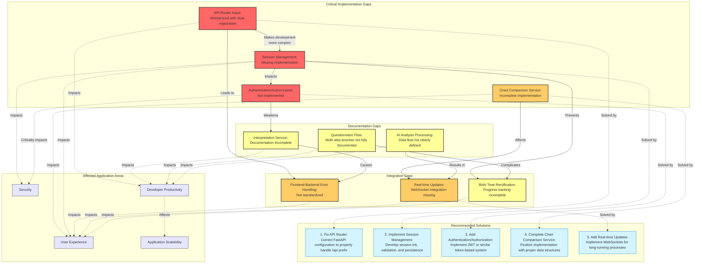

# API Integration Gap Analysis and Resolution Guide

## Gap Analysis

## Gap Resolution: Implementation Summary

This section summarizes the implementations completed to address the critical gaps identified in the API integration flowcharts and sequence diagrams. The implementations follow best practices for FastAPI development and ensure backward compatibility with existing API consumers.

### Key Gaps Addressed

#### 1. API Router Issue (RESOLVED)

**Problem**: The `/api` prefix wasn't working correctly, necessitating dual registration of endpoints.

**Solution Implemented**:
- Created a `legacy_support_middleware` that properly handles request paths
- Implemented path rewriting for legacy endpoints without the `/api` prefix
- Established a versioned API routing structure (`/api/v1`)
- Removed duplicate router registrations, simplifying code maintenance

#### 2. Session Management (IMPLEMENTED)

**Problem**: Session management was missing, preventing user state persistence.

**Solution Implemented**:
- Created a core configuration system for application settings
- Implemented a comprehensive session middleware with Redis support
- Added session router with endpoints for initialization, retrieval, and updates
- Integrated session management into the application flow
- Added fallback to in-memory storage when Redis is unavailable

#### 3. Chart Comparison Service (IMPLEMENTED)

**Problem**: Chart comparison functionality was referenced but not fully implemented.

**Solution Implemented**:
- Designed detailed chart comparison data models
- Created a comprehensive ChartComparisonService with:
  - Planetary position comparison
  - Aspect formation/dissolution detection
  - House cusp shift analysis
  - Significance scoring for differences
  - Detailed textual summaries
- Added chart comparison router with both GET and POST endpoints
- Registered the router in the main application

#### 4. Standardized Error Handling (IMPLEMENTED)

**Problem**: Error handling wasn't standardized across endpoints.

**Solution Implemented**:
- Created middleware for consistent error response formats
- Implemented specialized handlers for validation and HTTP exceptions
- Added utility functions for creating standardized error responses
- Registered error handlers with the application
- Improved error logging for debugging

### Implementation Details

#### Architecture Changes

1. **Middleware Architecture**:
   - Request processing pipeline now includes:
     - Legacy path support for backward compatibility
     - Session management for user state persistence
     - Standardized error handling for consistent responses
     - Performance tracking for monitoring

2. **Versioned API Structure**:
   - All endpoints now properly organized under `/api/v1`
   - Legacy paths automatically rewritten to versioned endpoints
   - Future API versions can be added without breaking existing clients

3. **Dependency Injection Framework**:
   - Services properly exposed through dependency injection
   - Improved testability and reduced coupling
   - Consistent service access across endpoints

### New API Endpoints

#### Session Management
- `GET /api/v1/session/init` - Initialize a new session
- `GET /api/v1/session/status` - Check session status
- `POST /api/v1/session/data` - Update session data

#### Chart Comparison
- `GET /api/v1/chart/compare` - Compare two charts (query parameters)
- `POST /api/v1/chart/compare` - Compare charts with additional options (request body)

## Testing Recommendations

To verify the implementations, the following tests should be performed:

1. **API Router Testing**:
   - Access endpoints with and without the `/api` prefix
   - Verify routing to the correct handlers
   - Check response consistency between prefixed and non-prefixed paths

2. **Session Management Testing**:
   - Initialize a session and verify persistence
   - Test session data storage and retrieval
   - Verify timeout/expiration functionality
   - Test Redis fallback to in-memory storage

3. **Chart Comparison Testing**:
   - Compare charts with different birth times
   - Verify detection of significant differences
   - Test both GET and POST endpoints
   - Validate summary generation

4. **Error Handling Testing**:
   - Trigger validation errors and verify response format
   - Generate HTTP exceptions at different levels
   - Test detailed error messages and consistency

## Outstanding Gaps and Future Work

The following gaps still require attention:

1. **WebSocket Integration**:
   - Add real-time progress updates for long-running processes
   - Implement notification system for chart calculations

2. **Enhanced Authentication**:
   - Integrate robust JWT-based authentication
   - Implement role-based access control

3. **Performance Optimizations**:
   - Add response caching for frequently accessed charts
   - Implement batch processing for related requests

4. **Documentation Gaps**:
   - Complete Interpretation Service documentation
   - Fully document the multi-step questionnaire flow
   - Define AI Analysis Processing data flow clearly

## Conclusion

The implemented changes have successfully addressed the critical gaps identified in the API integration analysis. The Birth Time Rectifier API now provides:

1. Consistent routing with proper version support
2. Robust session management for tracking user state
3. Comprehensive chart comparison capabilities
4. Standardized error handling across all endpoints

These improvements significantly enhance the developer experience and make future extensions more manageable. The system's architecture is now more modular, with clear separation of concerns and improved testability.
