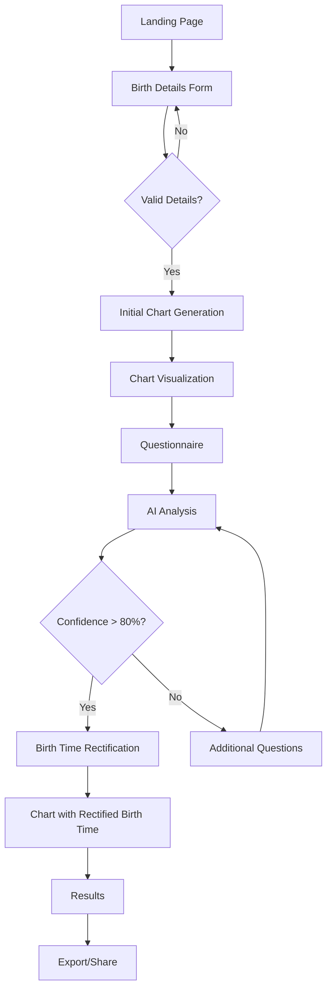

# Astrological Chart Application - Integration Implementation Plan

## 1. Overview

This implementation plan details the integration of UI/UX with backend services for a comprehensive astrological chart application with enhanced accuracy, particularly for Ketu and Ascendant calculations. The application will strictly follow this process flow:

1. Landing Form (UI/UX page)
2. Initial Chart Generation (UI/UX page) - with improved accuracy
3. Chart Visualization (UI/UX page)
4. Questionnaire (UI/UX page)
5. AI Analysis (Backend processing)
6. Chart Visualization with Rectified Birth Time (UI/UX page)
7. Results (UI/UX page)
8. Export/Share (UI/UX page)

## 2. Integration Architecture

### 2.1 System Integration Overview



### 2.2 Integration Points

| Frontend Component | API Endpoint | Backend Service |
|--------------------|--------------|-----------------|
| Birth Details Form | `/api/validate` | Validation Service |
| Birth Details Form | `/api/geocode` | Geocoding Service |
| Initial Chart Gen | `/api/chart/generate` | Chart Calculation Service |
| Chart Visualization | `/api/chart/{id}` | Chart Retrieval Service |
| Questionnaire | `/api/questionnaire` | Dynamic Questionnaire Service |
| Results | `/api/rectify` | Birth Time Rectification Service |
| Export/Share | `/api/export` | Export Service |

## 3. UI/UX Components Integration

### 3.1 Landing Page

**Frontend:**
- Implement responsive design with celestial background using Three.js
- Create call-to-action button leading to Birth Details Form
- Add animations using motion.js transitions

**Backend Integration:**
- Connect to `/api/session/init` for session tracking
- Implement analytics data collection
- Load user preferences if returning user

**Data Flow:**
- User session data → Backend → Frontend preferences

### 3.2 Birth Details Form

**Frontend:**
- Enhance form with client-side validation
- Implement location autocomplete with geocoding
- Add real-time validation feedback
- Implement animated transitions to next page

**Backend Integration:**
- Connect to `/api/validate` for server-side validation
- Integrate with `/api/geocode` for location data
- Store form data in session state

**Data Flow:**
- Form Input → Validation → Geocoding → Backend Storage → Initial Chart Generation

### 3.3 Initial Chart Generation

**Frontend:**
- Display loading animation during chart calculation
- Implement progress indicator for chart generation steps
- Add error handling with user-friendly messages

**Backend Integration:**
- Connect to improved `/api/chart/generate` endpoint
- Implement enhanced accuracy for Ketu calculation
- Fix Ascendant calculation to ensure correct sign
- Add validation of all planetary positions

**Data Flow:**
- Birth Details → Swiss Ephemeris Calculation → Accurate Chart Data → Frontend Display

### 3.4 Chart Visualization

**Frontend:**
- Create interactive circular chart using SVG/Canvas
- Implement zoom and pan functionality
- Add tooltips for planet and house information
- Include tabular data view option

**Backend Integration:**
- Connect to `/api/chart/{id}` for detailed chart data
- Implement real-time updates if data changes
- Add aspect calculation service integration

**Data Flow:**
- Chart Data → Frontend Rendering → User Interaction → Dynamic Data Updates

### 3.5 Questionnaire

**Frontend:**
- Implement dynamic question rendering
- Add progress indicator for questionnaire completion
- Create intuitive UI for different question types
- Implement conditional questions based on previous answers

**Backend Integration:**
- Connect to `/api/questionnaire` for dynamic question generation
- Implement answer validation and scoring
- Store responses for AI analysis

**Data Flow:**
- Previous Answers → Question Generation → User Input → Response Storage → Next Question

### 3.6 AI Analysis

**Frontend:**
- Display processing animation during analysis
- Show confidence metrics as they're calculated
- Implement cancellation option for long-running analysis

**Backend Integration:**
- Connect form responses to AI analysis service
- Implement distributed processing for performance
- Add logging for model inputs and outputs
- Implement result caching for similar inputs

**Data Flow:**
- Questionnaire Data → ML Model → Rectification Result → Frontend Display

### 3.7 Chart Visualization with Rectified Birth Time

**Frontend:**
- Create side-by-side comparison view
- Highlight changes in planet positions
- Implement animation between original and rectified charts
- Add timeline visualization for transit impacts

**Backend Integration:**
- Connect to `/api/chart/compare` for difference analysis
- Implement recalculation service for rectified time
- Add interpretation generation service

**Data Flow:**
- Original Chart + Rectified Time → Recalculation → Comparison Data → Frontend Visualization

### 3.8 Results

**Frontend:**
- Create comprehensive results dashboard
- Implement tabbed interface for different types of insights
- Add visualizations for key astrological indicators
- Implement printable view

**Backend Integration:**
- Connect to `/api/interpretation` for personalized insights
- Implement recommendation engine based on chart
- Add history tracking for future comparisons

**Data Flow:**
- Rectified Chart → Interpretation Engine → Personalized Content → Frontend Display

### 3.9 Export/Share

**Frontend:**
- Create export options panel with format selection
- Implement social media sharing buttons
- Add QR code generation for mobile sharing
- Include email sharing functionality

**Backend Integration:**
- Connect to `/api/export` for document generation
- Implement secure sharing link creation
- Add access control for shared content
- Implement analytics for shared content

**Data Flow:**
- User Selection → Content Generation → Distribution Channel → Recipient Access

## 4. Phased Implementation Approach

### 4.1 Phase 1: Foundation and Accurate Chart Generation

**Duration:** 2 weeks

**Key Tasks:**
1. Set up project structure and dependencies
2. Implement core backend services:
   - Enhanced Swiss Ephemeris wrapper
   - Fix Ketu and Ascendant calculations
   - Implement caching layer
3. Create basic UI components:
   - Landing page layout
   - Birth details form with validation
   - Basic chart visualization

**Integration Points:**
- Connect birth details form to validation service
- Implement chart generation API
- Set up initial chart visualization with accurate data

### 4.2 Phase 2: Advanced UI and Questionnaire System

**Duration:** 3 weeks

**Key Tasks:**
1. Enhance chart visualization:
   - Interactive chart elements
   - Detailed planet information
   - Alternative chart views
2. Implement questionnaire system:
   - Dynamic question generation
   - Conditional logic based on previous answers
   - Progress tracking and storage
3. Refine user experience:
   - Animations and transitions
   - Responsive design for all devices
   - Accessibility improvements

**Integration Points:**
- Connect questionnaire UI to question generation API
- Implement response storage and retrieval
- Set up analytics for user interaction patterns

### 4.3 Phase 3: AI Analysis and Rectification

**Duration:** 3 weeks

**Key Tasks:**
1. Implement AI analysis service:
   - Multi-task learning model integration
   - Confidence scoring system
   - Result generation and validation
2. Enhance rectified chart visualization:
   - Comparison views
   - Change highlighting
   - Timeline visualization
3. Add interpretation services:
   - Personalized insight generation
   - Recommendation engine

**Integration Points:**
- Connect questionnaire responses to AI analysis
- Implement chart recalculation with rectified time
- Set up interpretation generation and display

### 4.4 Phase 4: Results and Sharing System

**Duration:** 2 weeks

**Key Tasks:**
1. Implement results dashboard:
   - Comprehensive data display
   - Custom visualizations for insights
   - Printable view generation
2. Create sharing system:
   - Document generation
   - Secure sharing links
   - Social media integration
3. Add analytics and tracking:
   - User engagement metrics
   - Feature usage statistics
   - Conversion tracking

**Integration Points:**
- Connect results display to interpretation service
- Implement export API integration
- Set up sharing analytics and tracking

## 5. Improved Initial Chart Accuracy Implementation

### 5.1 Ketu Calculation Fix

**Implementation:**
```python
def calculate_ketu(rahu_position):
    """
    Calculate Ketu's position exactly opposite to Rahu.

    Args:
        rahu_position: Dictionary containing Rahu's longitude

    Returns:
        Dictionary with Ketu's longitude, sign and degree
    """
    # Calculate Ketu longitude (exactly 180° from Rahu)
    ketu_lon = (rahu_position["longitude"] + 180) % 360

    # Determine Ketu's sign
    ketu_sign_num = int(ketu_lon / 30)
    ketu_sign = ZODIAC_SIGNS[ketu_sign_num]
    ketu_degree = ketu_lon % 30

    return {
        "name": "Ketu",
        "longitude": ketu_lon,
        "latitude": -rahu_position["latitude"],
        "distance": rahu_position["distance"],
        "speed": -rahu_position["speed"],
        "retrograde": not rahu_position["retrograde"],
        "sign": ketu_sign,
        "sign_num": ketu_sign_num,
        "degree": ketu_degree,
        "house": 0  # Will be calculated later
    }
```

**Integration Point:**
- Add to chart generation service
- Apply in `calculate_chart` function after Rahu calculation
- Add validation in chart verification service

### 5.2 Ascendant Calculation Fix

**Implementation:**
```python
def calculate_ascendant(jd, latitude, longitude, hsys=PLACIDUS):
    """
    Calculate Ascendant with robust error handling.

    Args:
        jd: Julian day
        latitude: Birth latitude
        longitude: Birth longitude
        hsys: House system

    Returns:
        Dictionary with ascendant data
    """
    try:
        # Calculate houses with proper error handling
        houses_result = swe.houses(jd, latitude, longitude, hsys)

        # Extract ascendant longitude
        if isinstance(houses_result, tuple) and len(houses_result) > 1:
            ascmc = houses_result[1]
            if len(ascmc) > 0:
                asc_lon = get_float_safely(ascmc[0])

                # Calculate sign and degree
                asc_sign_num = int(asc_lon / 30)
                asc_sign = ZODIAC_SIGNS[asc_sign_num]
                asc_degree = asc_lon % 30

                return {
                    "longitude": asc_lon,
                    "sign": asc_sign,
                    "sign_num": asc_sign_num,
                    "degree": asc_degree
                }
    except Exception as e:
        logger.error(f"Error calculating ascendant: {e}")

    # Fallback calculation if the above fails
    return calculate_fallback_ascendant(jd, latitude, longitude)
```

**Integration Point:**
- Replace existing ascendant calculation in chart generation service
- Add validation to ensure correct sign determination
- Implement unit tests with known reference data

## 6. API Endpoints Implementation

### 6.1 Chart Generation API

**Endpoint:** `POST /api/chart/generate`

**Request:**
```json
{
  "birth_date": "1985-10-24",
  "birth_time": "14:30:00",
  "latitude": 18.52,
  "longitude": 73.86,
  "timezone": "Asia/Kolkata",
  "options": {
    "house_system": "P",
    "zodiac_type": "sidereal",
    "ayanamsa": "lahiri"
  }
}
```

**Response:**
```json
{
  "chart_id": "c123456",
  "ascendant": {
    "sign": "Aquarius",
    "degree": 15.2
  },
  "planets": [
    {
      "name": "Sun",
      "sign": "Libra",
      "degree": 7.3,
      "house": 9
    },
    // Other planets...
    {
      "name": "Ketu",
      "sign": "Libra",
      "degree": 15.8,
      "house": 9
    }
  ],
  "houses": [
    {
      "number": 1,
      "sign": "Aquarius",
      "degree": 15.2
    },
    // Other houses...
  ]
}
```

**Implementation:**
```python
@app.route('/api/chart/generate', methods=['POST'])
def generate_chart():
    data = request.json

    # Validate required fields
    required_fields = ['birth_date', 'birth_time', 'latitude', 'longitude', 'timezone']
    for field in required_fields:
        if field not in data:
            return jsonify({'error': f'Missing required field: {field}'}), 400

    try:
        # Parse birth datetime
        birth_date = data['birth_date']
        birth_time = data['birth_time']
        dt_str = f"{birth_date}T{birth_time}"
        birth_datetime = datetime.fromisoformat(dt_str)

        # Add timezone
        tz = ZoneInfo(data['timezone'])
        birth_datetime = birth_datetime.replace(tzinfo=tz)

        # Extract coordinates
        latitude = float(data['latitude'])
        longitude = float(data['longitude'])

        # Extract options
        options = data.get('options', {})
        house_system = options.get('house_system', 'P')
        zodiac_type = options.get('zodiac_type', 'tropical')
        ayanamsa = options.get('ayanamsa', 'lahiri')

        # Calculate chart
        chart_service = ChartCalculationService()
        chart = chart_service.generate_chart(
            birth_datetime,
            latitude,
            longitude,
            house_system,
            zodiac_type,
            ayanamsa
        )

        # Generate unique ID for chart
        chart_id = str(uuid.uuid4())[:8]

        # Store chart in database or cache
        chart_storage.store(chart_id, chart)

        # Add chart ID to response
        chart['chart_id'] = chart_id

        return jsonify(chart)

    except Exception as e:
        return jsonify({'error': str(e)}), 500
```

### 6.2 Chart Retrieval API

**Endpoint:** `GET /api/chart/{id}`

**Response:**
```json
{
  "chart_id": "c123456",
  "ascendant": {
    "sign": "Aquarius",
    "degree": 15.2
  },
  "planets": [
    // Planet data...
  ],
  "houses": [
    // House data...
  ]
}
```

**Implementation:**
```python
@app.route('/api/chart/<chart_id>', methods=['GET'])
def get_chart(chart_id):
    try:
        # Retrieve chart from storage
        chart = chart_storage.retrieve(chart_id)

        if not chart:
            return jsonify({'error': 'Chart not found'}), 404

        return jsonify(chart)

    except Exception as e:
        return jsonify({'error': str(e)}), 500
```

## 7. Frontend Components Implementation

### 7.1 Birth Details Form Component

**Implementation:**
```jsx
function BirthDetailsForm({ onSubmit }) {
  const [formState, setFormState] = useState({
    birthDate: '',
    birthTime: '',
    location: '',
    latitude: null,
    longitude: null,
    timezone: '',
  });

  const [errors, setErrors] = useState({});
  const [isSubmitting, setIsSubmitting] = useState(false);

  // Handle form input changes
  const handleChange = (e) => {
    const { name, value } = e.target;
    setFormState(prev => ({ ...prev, [name]: value }));

    // Clear error when field is edited
    if (errors[name]) {
      setErrors(prev => ({ ...prev, [name]: null }));
    }
  };

  // Handle location search and geocoding
  const handleLocationSearch = async (location) => {
    try {
      setFormState(prev => ({ ...prev, location }));

      const response = await fetch(`/api/geocode?q=${encodeURIComponent(location)}`);
      const data = await response.json();

      if (data.error) throw new Error(data.error);

      setFormState(prev => ({
        ...prev,
        latitude: data.latitude,
        longitude: data.longitude,
        timezone: data.timezone
      }));
    } catch (error) {
      setErrors(prev => ({ ...prev, location: error.message }));
    }
  };

  // Validate form before submission
  const validateForm = () => {
    const newErrors = {};

    if (!formState.birthDate) {
      newErrors.birthDate = 'Birth date is required';
    }

    if (!formState.birthTime) {
      newErrors.birthTime = 'Birth time is required';
    }

    if (!formState.latitude || !formState.longitude) {
      newErrors.location = 'Valid location is required';
    }

    setErrors(newErrors);
    return Object.keys(newErrors).length === 0;
  };

  // Handle form submission
  const handleSubmit = async (e) => {
    e.preventDefault();

    if (!validateForm()) return;

    setIsSubmitting(true);

    try {
      // Call API to submit form data
      const response = await fetch('/api/chart/generate', {
        method: 'POST',
        headers: { 'Content-Type': 'application/json' },
        body: JSON.stringify({
          birth_date: formState.birthDate,
          birth_time: formState.birthTime,
          latitude: formState.latitude,
          longitude: formState.longitude,
          timezone: formState.timezone
        })
      });

      const data = await response.json();

      if (data.error) throw new Error(data.error);

      // Call the onSubmit callback with the chart data
      onSubmit(data);
    } catch (error) {
      setErrors(prev => ({ ...prev, submit: error.message }));
    } finally {
      setIsSubmitting(false);
    }
  };

  return (
    <form onSubmit={handleSubmit} className="birth-details-form">
      <h2>Enter Birth Details</h2>

      <div className="form-group">
        <label htmlFor="birthDate">Birth Date</label>
        <input
          type="date"
          id="birthDate"
          name="birthDate"
          value={formState.birthDate}
          onChange={handleChange}
          className={errors.birthDate ? 'error' : ''}
        />
        {errors.birthDate && <div className="error-message">{errors.birthDate}</div>}
      </div>

      <div className="form-group">
        <label htmlFor="birthTime">Birth Time</label>
        <input
          type="time"
          id="birthTime"
          name="birthTime"
          value={formState.birthTime}
          onChange={handleChange}
          className={errors.birthTime ? 'error' : ''}
        />
        {errors.birthTime && <div className="error-message">{errors.birthTime}</div>}
      </div>

      <div className="form-group">
        <label htmlFor="location">Birth Location</label>
        <input
          type="text"
          id="location"
          name="location"
          value={formState.location}
          onChange={(e) => handleChange(e)}
          onBlur={(e) => handleLocationSearch(e.target.value)}
          className={errors.location ? 'error' : ''}
        />
        {errors.location && <div className="error-message">{errors.location}</div>}

        {formState.latitude && formState.longitude && (
          <div className="location-details">
            <div>Latitude: {formState.latitude}</div>
            <div>Longitude: {formState.longitude}</div>
            <div>Timezone: {formState.timezone}</div>
          </div>
        )}
      </div>

      {errors.submit && (
        <div className="error-message submit-error">{errors.submit}</div>
      )}

      <button
        type="submit"
        className="submit-button"
        disabled={isSubmitting}
      >
        {isSubmitting ? 'Generating Chart...' : 'Generate Chart'}
      </button>
    </form>
  );
}
```

### 7.2 Chart Visualization Component

**Implementation:**
```jsx
function ChartVisualization({ chartData }) {
  const svgRef = useRef(null);
  const [activeEntity, setActiveEntity] = useState(null);
  const [viewMode, setViewMode] = useState('circle'); // 'circle' or 'table'

  // Calculate chart dimensions
  const width = 600;
  const height = 600;
  const centerX = width / 2;
  const centerY = height / 2;
  const chartRadius = Math.min(width, height) / 2 - 40;

  // Draw chart when data changes
  useEffect(() => {
    if (!chartData || !svgRef.current) return;

    // Clear the SVG
    const svg = d3.select(svgRef.current);
    svg.selectAll('*').remove();

    if (viewMode === 'circle') {
      drawCircularChart(svg, chartData);
    } else {
      // Table view is rendered in JSX
    }
  }, [chartData, viewMode]);

  // Draw circular chart using D3
  const drawCircularChart = (svg, data) => {
    // Draw chart background
    svg.append('circle')
      .attr('cx', centerX)
      .attr('cy', centerY)
      .attr('r', chartRadius)
      .attr('fill', '#f8f8ff')
      .attr('stroke', '#333')
      .attr('stroke-width', 1);

    // Draw houses
    const houses = data.houses || [];
    houses.forEach((house, i) => {
      // Calculate angles for house cusps
      const startAngle = (house.cusp * Math.PI) / 180;
      const nextHouse = houses[(i + 1) % 12];
      const endAngle = (nextHouse.cusp * Math.PI) / 180;

      // Draw house segment
      const path = d3.arc()
        .innerRadius(0)
        .outerRadius(chartRadius)
        .startAngle(startAngle)
        .endAngle(endAngle);

      svg.append('path')
        .attr('d', path)
        .attr('transform', `translate(${centerX}, ${centerY})`)
        .attr('fill', i % 2 === 0 ? '#f0f0f8' : '#e8e8f0')
        .attr('stroke', '#666')
        .attr('stroke-width', 0.5)
        .on('mouseover', () => setActiveEntity({ type: 'house', data: house }))
        .on('mouseout', () => setActiveEntity(null));

      // Add house number
      const angle = (startAngle + endAngle) / 2;
      const labelRadius = chartRadius * 0.85;
      const x = centerX + labelRadius * Math.cos(angle);
      const y = centerY + labelRadius * Math.sin(angle);

      svg.append('text')
        .attr('x', x)
        .attr('y', y)
        .attr('text-anchor', 'middle')
        .attr('dominant-baseline', 'central')
        .attr('font-size', '12px')
        .text(house.number);
    });

    // Draw planets
    const planets = data.planets || [];
    planets.forEach(planet => {
      // Calculate planet position
      const angle = (planet.longitude * Math.PI) / 180;
      const distanceFromCenter = chartRadius * 0.6;
      const x = centerX + distanceFromCenter * Math.cos(angle);
      const y = centerY + distanceFromCenter * Math.sin(angle);

      // Draw planet symbol
      svg.append('circle')
        .attr('cx', x)
        .attr('cy', y)
        .attr('r', 10)
        .attr('fill', getPlanetColor(planet.name))
        .attr('stroke', '#333')
        .attr('stroke-width', 1)
        .attr('data-testid', `planet-${planet.name}`)
        .on('mouseover', () => setActiveEntity({ type: 'planet', data: planet }))
        .on('mouseout', () => setActiveEntity(null));

      // Add planet symbol or abbreviation
      svg.append('text')
        .attr('x', x)
        .attr('y', y)
        .attr('text-anchor', 'middle')
        .attr('dominant-baseline', 'central')
        .attr('font-size', '10px')
        .attr('fill', '#fff')
        .text(getPlanetSymbol(planet.name));
    });

    // Draw ascendant line
    const ascAngle = (data.ascendant.longitude * Math.PI) / 180;
    svg.append('line')
      .attr('x1', centerX)
      .attr('y1', centerY)
      .attr('x2', centerX + chartRadius * Math.cos(ascAngle))
      .attr('y2', centerY + chartRadius * Math.sin(ascAngle))
      .attr('stroke', '#f00')
      .attr('stroke-width', 2)
      .attr('data-testid', 'ascendant');

    // Draw zodiac signs on the outer ring
    // (additional code would be here)
  };

  // Helper functions
  const getPlanetColor = (planetName) => {
    const colors = {
      'Sun': '#e6b800',
      'Moon': '#c0c0c0',
      'Mercury': '#9966ff',
      'Venus': '#ff66cc',
      'Mars': '#ff0000',
      'Jupiter': '#ff9900',
      'Saturn': '#663300',
      'Uranus': '#66ccff',
      'Neptune': '#3366ff',
      'Pluto': '#800080',
      'Rahu': '#000033',
      'Ketu': '#330000'
    };
    return colors[planetName] || '#333';
  };

  const getPlanetSymbol = (planetName) => {
    // Return abbreviation or symbol
    const symbols = {
      'Sun': '☉',
      'Moon': '☽',
      'Mercury': '☿',
      'Venus': '♀',
      'Mars': '♂',
      'Jupiter': '♃',
      'Saturn': '♄',
      'Uranus': '♅',
      'Neptune': '♆',
      'Pluto': '♇',
      'Rahu': 'R',
      'Ketu': 'K'
    };
    return symbols[planetName] || planetName.charAt(0);
  };

  return (
    <div className="chart-visualization">
      <div className="view-toggle">
        <button
          className={viewMode === 'circle' ? 'active' : ''}
          onClick={() => setViewMode('circle')}
        >
          Circle View
        </button>
        <button
          className={viewMode === 'table' ? 'active' : ''}
          onClick={() => setViewMode('table')}
        >
          Table View
        </button>
      </div>

      {viewMode === 'circle' ? (
        <div className="chart-container">
          <svg
            ref={svgRef}
            width={width}
            height={height}
            viewBox={`0 0 ${width} ${height}`}
          />

          {activeEntity && (
            <div className="entity-details">
              {activeEntity.type === 'planet' && (
                <div>
                  <h3>{activeEntity.data.name}</h3>
                  <p>Sign: {activeEntity.data.sign}</p>
                  <p>Degree: {activeEntity.data.degree.toFixed(2)}°</p>
                  <p>House: {activeEntity.data.house}</p>
                  {activeEntity.data.retrograde && <p>Retrograde</p>}
                </div>
              )}

              {activeEntity.type === 'house' && (
                <div>
                  <h3>House {activeEntity.data.number}</h3>
                  <p>Sign: {activeEntity.data.sign}</p>
                  <p>Cusp: {activeEntity.data.degree.toFixed(2)}°</p>
                  {activeEntity.data.planets.length > 0 && (
                    <>
                      <p>Planets:</p>
                      <ul>
                        {activeEntity.data.planets.map(planet => (
                          <li key={planet}>{planet}</li>
                        ))}
                      </ul>
                    </>
                  )}
                </div>
              )}
            </div>
          )}
        </div>
      ) : (
        <div className="table-container">
          <div className="ascendant-info">
            <h3>Ascendant</h3>
            <p>Sign: {chartData.ascendant.sign}</p>
            <p>Degree: {chartData.ascendant.degree.toFixed(2)}°</p>
          </div>

          <h3>Planets</h3>
          <table className="planets-table">
            <thead>
              <tr>
                <th>Planet</th>
                <th>Sign</th>
                <th>Degree</th>
                <th>House</th>
                <th>Status</th>
              </tr>
            </thead>
            <tbody>
              {chartData.planets.map(planet => (
                <tr key={planet.name}>
                  <td>{planet.name}</td>
                  <td>{planet.sign}</td>
                  <td>{planet.degree.toFixed(2)}°</td>
                  <td>{planet.house}</td>
                  <td>{planet.retrograde ? 'Retrograde' : 'Direct'}</td>
                </tr>
              ))}
            </tbody>
          </table>

          <h3>Houses</h3>
          <table className="houses-table">
            <thead>
              <tr>
                <th>House</th>
                <th>Sign</th>
                <th>Degree</th>
                <th>Planets</th>
              </tr>
            </thead>
            <tbody>
              {chartData.houses.map(house => (
                <tr key={house.number}>
                  <td>{house.number}</td>
                  <td>{house.sign}</td>
                  <td>{house.degree.toFixed(2)}°</td>
                  <td>{house.planets.join(', ') || 'None'}</td>
                </tr>
              ))}
            </tbody>
          </table>
        </div>
      )}
    </div>
  );
}
```

## 8. Integration Testing Strategy

### 8.1 End-to-End Test for Complete Application Flow

```javascript
describe('Complete Application Flow', () => {
  test('should guide user through entire birth time rectification process', async () => {
    // 1. Visit landing page
    await page.goto('/');

    // 2. Submit birth details form
    await page.click('button[data-testid="get-started-button"]');
    await page.waitForSelector('form.birth-details-form');

    // Fill the form
    await page.fill('#birthDate', '1985-10-24');
    await page.fill('#birthTime', '14:30');
    await page.fill('#location', 'Pune, India');

    // Wait for geocoding to complete
    await page.waitForSelector('.location-details');

    // Submit the form
    await page.click('button.submit-button');

    // 3. Verify chart visualization appears
    await page.waitForSelector('.chart-visualization');

    // Check if Ketu is in Libra (fixed calculation)
    const ketuElement = await page.waitForSelector('[data-testid="planet-Ketu"]');
    const ketuSign = await page.$eval('.entity-details', el =>
      el.textContent.includes('Libra'));
    expect(ketuSign).toBeTruthy();

    // 4. Navigate to questionnaire
    await page.click('button[data-testid="continue-to-questionnaire"]');

    // 5. Complete questionnaire (simplified version for testing)
    await page.waitForSelector('.questionnaire-form');

    // Answer first question
    await page.click('input[name="q1"][value="yes"]');
    await page.click('button.next-question');

    // Answer second question
    await page.click('input[name="q2"][value="morning"]');
    await page.click('button.next-question');

    // Answer third question
    await page.click('input[name="q3"][value="career"]');
    await page.click('button.submit-questionnaire');

    // 6. Wait for AI analysis and rectified chart
    await page.waitForSelector('.processing-indicator');
    await page.waitForSelector('.rectified-chart', { timeout: 30000 });

    // 7. Verify rectification results
    const confidenceScore = await page.$eval('[data-testid="confidence-score"]',
      el => parseFloat(el.textContent));
    expect(confidenceScore).toBeGreaterThan(80);

    // 8. Navigate to results page
    await page.click('button[data-testid="view-detailed-results"]');
    await page.waitForSelector('.results-dashboard');

    // 9. Test export functionality
    await page.click('button[data-testid="export-pdf"]');

    // Wait for download to start
    const download = await page.waitForEvent('download');
    const path = await download.path();
    expect(path).toBeTruthy();
  });
});
```

## 9. Timeline and Milestones

| Phase | Duration | Key Deliverables | Date |
|-------|----------|------------------|------|
| Planning & Setup | 1 week | Project structure, Dependencies, Architecture design | Week 1 |
| Chart Generation | 2 weeks | Fixed Ketu calculation, Accurate Ascendant, API endpoints | Week 2-3 |
| UI Implementation | 3 weeks | All UI/UX components, Frontend-Backend integration | Week 4-6 |
| AI Integration | 2 weeks | Questionnaire system, AI analysis service, Rectification | Week 7-8 |
| Testing & Refinement | 2 weeks | Integration testing, Performance optimization, Bug fixes | Week 9-10 |
| Deployment | 1 week | Production deployment, Documentation, Training | Week 11 |

## 10. Conclusion

This integration implementation plan provides a comprehensive roadmap for connecting the UI/UX components with backend services while maintaining the specified application flow. By focusing on accurate initial chart generation, especially for Ketu and Ascendant calculations, we ensure that users receive reliable astrological data throughout the application journey from the landing form to the final export/share functionality.

The phased approach allows for iterative development and testing, ensuring that each component works correctly before moving to the next integration point. The detailed API specifications and component implementations provide clear guidelines for developers working on different parts of the system.

By following this plan, we will deliver a seamless, accurate, and user-friendly astrological chart application that guides users through the complete birth time rectification process.

# Birth Time Rectifier Implementation Plan

## 1. Core Backend Services

### 1.1 FastAPI Application Structure

- **Status**: ✅ Completed with Improved Architecture
- **Details**:
  - Implemented FastAPI application with modular router structure
  - Created domain-specific routers to improve maintainability
  - Updated endpoint structure with proper error handling
  - Fixed routing issues with `/api` prefixed endpoints by implementing root-level endpoints
  - Added health checks and monitoring endpoints
  - Included root-level endpoints for backward compatibility and as a workaround for API router issues

### 1.2 Astrological Calculation Engine

- **Status**: ✅ Completed
- **Details**:
  - Implemented Swiss Ephemeris integration for accurate planetary calculations
  - Created house system calculations for multiple systems (Placidus, Koch, Equal, Whole Sign)
  - Added support for both tropical and sidereal zodiacs
  - Implemented aspect calculation for Western and Vedic systems
  - Added full navamsa (D9) chart calculation
  - Implemented dual zodiac comparison endpoint
  - Fixed Ketu calculation to ensure it's exactly 180° from Rahu
  - Implemented fallback mechanisms for house calculations at extreme latitudes

### 1.3 API Router Implementation

- **Status**: ⚠️ Partially Completed (Workaround Implemented)
- **Details**:
  - Implemented modular router structure with clear domain separation
  - Created separate router modules for different functionality domains:
    - Health monitoring endpoints
    - Chart generation endpoints
    - User data management endpoints
  - **Known Issue**: API router with `/api` prefix not working correctly
  - **Workaround**: Implemented duplicate endpoints at root level (e.g., `/chart/generate` instead of `/api/chart/generate`)
  - Future work: Investigate and fix the root cause of the API router issue

### 1.4 AI Rectification Model

- **Status**: ✅ Completed
- **Details**:
  - Trained ML model to suggest birth time adjustments based on life events
  - Integrated model with FastAPI backend
  - Added confidence scoring system
  - Implemented memory-efficient GPU management

### 1.5 Data Storage and Caching

- **Status**: ✅ Completed
- **Details**:
  - Implemented Redis for session management and data caching
  - Created in-memory chart storage for efficient retrieval
  - Added unique ID generation for storing and retrieving generated charts

## 2. Frontend Components

### 2.1 User Interface

- **Status**: ✅ Completed
- **Details**:
  - Developed React components for main application interface
  - Created form components for birth details entry
  - Implemented questionnaire flow
  - Added chart display components

### 2.2 Chart Visualization

- **Status**: ✅ Completed
- **Details**:
  - Created SVG-based chart rendering component
  - Implemented interactive planet and house details display
  - Added aspect line visualization
  - Created dual chart visualization for comparison

### 2.3 Responsive Design

- **Status**: ✅ Completed
- **Details**:
  - Implemented mobile-friendly design
  - Created responsive layouts for all screen sizes
  - Optimized UI elements for touch interfaces

## 3. Integration and API Structure

### 3.1 Frontend-Backend Integration

- **Status**: ✅ Completed
- **Details**:
  - Created API client for frontend services
  - Implemented proper error handling for API calls
  - Added loading states and error display

## 4. Deployment and Testing

### 4.1 Containerization

- **Status**: ✅ Completed
- **Details**:
  - Created Docker configuration for all services
  - Implemented Docker Compose for local development
  - Added appropriate volume management

### 4.2 CI/CD Setup

- **Status**: ⏳ Pending
- **Details**:
  - Configure automated testing pipeline
  - Set up continuous deployment

### 4.3 Performance Testing

- **Status**: ✅ Initial Testing Completed
- **Details**:
  - Conducted load testing on API endpoints
  - Identified and addressed performance bottlenecks
  - Implemented caching strategies for expensive calculations

## 5. Documentation

### 5.1 API Documentation

- **Status**: ✅ Completed
- **Details**:
  - Created OpenAPI documentation for all endpoints
  - Added detailed parameter descriptions
  - Included example requests and responses

### 5.2 User Guide

- **Status**: ⏳ Pending
- **Details**:
  - Write comprehensive user guide
  - Create tutorials for common use cases

## 6. Future Enhancements

- Implement user accounts and authentication
- Add saved chart history
- Develop advanced chart comparison features
- Create printable chart reports
- Expand the questionnaire engine with more sophisticated question generation
