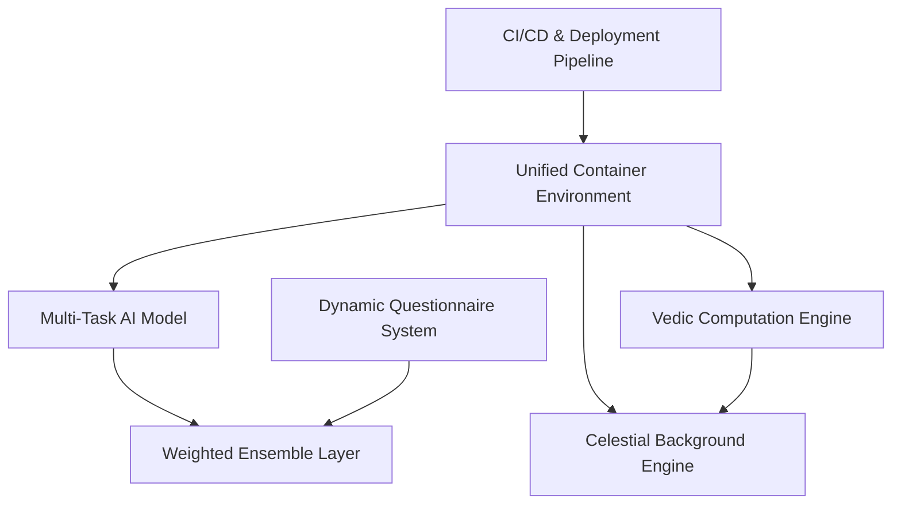
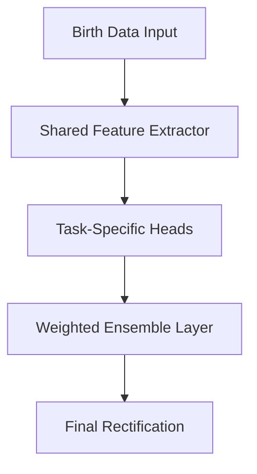

---

# 1. System Overview, Foundational Principles & Core Technical Requirements

---

## 1. System Overview & Foundational Principles

This AI-driven Vedic Birth Time Rectification System employs a unified multi-task model architecture with immersive celestial backgrounds. The system balances:

- **GPU-accelerated AI processing** with unified model architecture
- **Immersive celestial backgrounds** with depth-based parallax effects
- **Dynamic questionnaire generation** with confidence-based adaptation
- **Self-improving model architecture** through weighted ensemble learning
- **Vedic-compliant chart generation** with multiple divisional chart support

---

## 2. Core Technical Requirements Analysis

- **GPU Processing:** Utilize CUDA-enabled GPUs for accelerated AI computations within a unified model.
- **Celestial Visualization:** Implement high-quality WebGL-based celestial backgrounds with depth effects and parallax scrolling.
- **Dynamic Questionnaires:** Generate questions based on confidence scores to refine the birth time rectification.
- **Ensemble Learning:** Integrate outputs from multiple task-specific heads using a weighted consensus algorithm.
- **Vedic Computation:** Integrate traditional Vedic computation engines (Swiss Ephemeris, WASM-based modules) to ensure compliance with ancient texts and principles.

---

## 3. Architectural Blueprint Components

The system is containerized using Docker with multi-stage build approach. Below is the Dockerfile used as a base for the system:

```dockerfile
# Base Image with CUDA 12.2 and Node.js 20 LTS
FROM nvidia/cuda:12.2.0-runtime-ubuntu22.04

# System Dependencies
RUN apt-get update && \
    apt-get install -y python3.10 python3-pip nodejs npm redis-server \
    libgl1 libglib2.0-0 libxi6 libxext6 libx11-6

# AI Framework Setup
RUN pip install --no-cache-dir \
    torch==2.1.1+cu121 \
    transformers==4.38.2 \
    redis==5.0.1

# Visualization Stack
RUN npm install -g three@0.152.0 @react-three/fiber@8.14.1 \
    drei@9.57.0 react@18.2.0 next@14.1.0

# Vedic Computation Engine
COPY --from=vedic-builder /app/sweph /usr/local/lib/sweph
COPY --from=vedic-builder /app/jyotish.wasm /opt/vedic/

# Service Orchestration
COPY supervisord.conf /etc/supervisor/conf.d/
EXPOSE 3000 8000 6379
CMD ["supervisord", "-n"]
```

---

## 4. High-Level Architecture Diagram

Below is a high-level architecture diagram illustrating the core components and their interactions:



---

# 2. AI Model Architecture, Celestial Visualization & Adaptive Questionnaire, and Continuous Learning

---

## 1. Unified AI Engine Framework

### Multi-Task Model Architecture

The system employs a unified multi-task model that efficiently handles all aspects of Vedic birth time rectification through a shared backbone and specialized task heads:

- **Shared Feature Extractor:**
  - *Architecture:* Transformer-based backbone with cross-attention mechanisms
  - *Input Processing:* Unified embedding layer for all astrological parameters
  - *Feature Learning:* Hierarchical representation of planetary positions and temporal patterns

- **Task-Specific Heads:**
  1. **Tattva Analysis Head:**
     - *Focus:* Planetary strength computation via Shadbala
     - *Architecture:* Specialized layers for Vimshopaka Bala calculation
     - *Training:* Supervised learning on Brihat Parashara Hora Shastra dataset

  2. **Nadi Validation Head:**
     - *Function:* Nadi Amsha consistency verification
     - *Architecture:* Custom layers for divisional chart analysis
     - *Learning:* Adaptive training on D60 chart patterns

  3. **KP Rectification Head:**
     - *Methodology:* Integrated KP system analysis
     - *Architecture:* Sub-Lord theory implementation layers
     - *Output:* Refined birth time probability distribution

### Unified Model Implementation

The following Python snippet demonstrates the efficient multi-task architecture:

```python
class UnifiedRectificationModel:
    def __init__(self):
        self.shared_backbone = TransformerBackbone(
            hidden_size=768,
            num_layers=12,
            num_heads=12
        )
        
        self.task_heads = {
            'tattva': TattvaHead(hidden_size=768),
            'nadi': NadiHead(hidden_size=768),
            'kp': KPHead(hidden_size=768)
        }
        
    def forward(self, birth_data):
        # Shared feature extraction
        shared_features = self.shared_backbone(birth_data)
        
        # Task-specific predictions
        results = {
            name: head(shared_features)
            for name, head in self.task_heads.items()
        }
        
        # Weighted ensemble combination
        weights = {'tattva': 0.4, 'nadi': 0.35, 'kp': 0.25}
        final_rectification = sum(
            results[k] * weights[k] for k in weights
        )
        
        return final_rectification
```

### Unified Architecture Flow Diagram



---

## 2. Immersive Celestial Background System

### Depth-Based Parallax Engine

The system creates an immersive celestial environment with multiple depth layers and parallax effects. Each layer represents different celestial elements with varying depths and movement speeds:

```typescript
class CelestialBackgroundEngine {
    private layers: CelestialLayer[];
    private scene: THREE.Scene;
    private camera: THREE.PerspectiveCamera;
    
    constructor() {
        this.initializeLayers();
        this.setupParallaxEffects();
    }
    
    private initializeLayers() {
        this.layers = [
            new CelestialLayer({
                depth: 0,
                content: 'stars',
                parallaxFactor: 0.1
            }),
            new CelestialLayer({
                depth: -100,
                content: 'nebulae',
                parallaxFactor: 0.2
            }),
            new CelestialLayer({
                depth: -200,
                content: 'galaxies',
                parallaxFactor: 0.3
            })
        ];
    }
    
    public updateParallax(scrollPosition: number): void {
        this.layers.forEach(layer => {
            layer.updatePosition(scrollPosition);
        });
        this.renderer.render(this.scene, this.camera);
    }
}
```

### Progressive Loading System

Efficient background rendering is achieved through progressive loading and quality scaling:

```typescript
class ProgressiveLoader {
    private textureLoader: THREE.TextureLoader;
    private qualityLevels: Map<string, number>;
    
    async loadCelestialTexture(path: string, quality: number): Promise<THREE.Texture> {
        const texture = await this.textureLoader.loadAsync(path);
        texture.minFilter = THREE.LinearMipMapLinearFilter;
        texture.generateMipmaps = true;
        
        return this.optimizeTexture(texture, quality);
    }
}
```

### Traditional Chart Rendering

For astrological data visualization, the system uses traditional 2D chart rendering:

```typescript
class ChartRenderer {
    private svg: d3.Selection;
    
    constructor(containerId: string) {
        this.svg = d3.select(containerId)
            .append('svg')
            .attr('viewBox', '0 0 800 800');
    }
    
    public renderChart(data: ChartData): void {
        this.drawHouses(data.houses);
        this.drawPlanets(data.planets);
        this.drawAspects(data.aspects);
    }
}
```

---

## 3. Adaptive Questionnaire System

The system includes an adaptive questionnaire mechanism that generates follow-up questions based on confidence scores from the unified model. This helps refine rectification results through user feedback:

```python
class QuestionEngine:
    def generate_questions(self, confidence_scores):
        questions = []
        if confidence_scores['tattva'] < 0.7:
            questions.append({
                'type': 'multiple_choice',
                'text': 'Did you have any major health events around age 18-22?',
                'options': ['Yes', 'No', 'Unsure'],
                'weight': 0.15
            })
        return questions
```

---

## 4. Continuous Learning Infrastructure

### Reinforcement Learning Loop

A reinforcement learning loop is integrated to continuously improve the unified model based on historical data and user feedback:

```python
class ModelTrainer:
    def __init__(self):
        self.replay_buffer = PrioritizedReplayBuffer(capacity=1e5)
        self.policy_net = DuelingDQN(input_size=128, output_size=3)
        
    def update_policies(self):
        batch = self.replay_buffer.sample(1024)
        loss = self.policy_net.train_step(batch)
        # Update target network every 1000 steps
        if self.steps % 1000 == 0:
            self.target_net.load_state_dict(self.policy_net.state_dict())
```

### Automated Quality Control

To ensure the accuracy of generated charts, an automated quality control module validates the consistency of divisional charts:

```python
class ChartValidator:
    def validate(self, chart_data):
        # Check D1-D9 chart consistency
        errors = []
        if not self._check_ascendant_match(chart_data):
            errors.append('Ascendant mismatch in divisional charts')
        return errors
```

### Continuous Learning Flow Diagram

```mermaid
flowchart TD
    A[User Input & Birth Data]
    B[Unified AI Model]
    C[Adaptive Questionnaire]
    D[ModelTrainer (RL Loop)]
    E[ChartValidator (Quality Control)]
    
    A --> B
    B --> C
    C --> D
    D --> E
```

---

# 3. Deployment, Performance Optimization, Security, and Container Management

---

## 1. Deployment Strategy

### Container Architecture

- **Local Development Setup:**
  - Use Docker with GPU passthrough for development environment
  - Leverage MinIO for local object storage
  - Implement Redis for caching and session management

- **Production Deployment:**
  - Deploy on Kubernetes with GPU node pool
  - Utilize Argo CD for GitOps-based continuous deployment
  - Integrate Prometheus and Grafana for monitoring

### CI/CD Pipeline

Example GitHub Actions workflow:

```yaml
jobs:
  deploy:
    runs-on: ubuntu-latest
    steps:
    - name: Build and Push Docker
      uses: docker/build-push-action@v4
      with:
        context: .
        platforms: linux/arm64
        tags: user/app:latest
        push: true
        
    - name: Deploy to Kubernetes
      uses: steebchen/kubectl@v2
      with:
        command: rollout restart deployment/vedic-rectifier
```

---

## 2. Performance Optimization

### GPU Memory Management

```python
class GPUMemoryManager:
    def __init__(self):
        self.model_allocation = 0.7  # 70% for AI model
        self.viz_allocation = 0.3  # 30% for visualization
        
    def optimize_memory(self):
        total_memory = torch.cuda.get_device_properties(0).total_memory
        torch.cuda.set_per_process_memory_fraction(self.model_allocation)
```

### Background Optimization

```typescript
class TextureManager {
    private static readonly QUALITY_LEVELS = {
        HIGH: 2048,
        MEDIUM: 1024,
        LOW: 512
    };
    
    constructor() {
        this.currentQuality = this.detectOptimalQuality();
    }
    
    private detectOptimalQuality(): number {
        const gpu = this.getGPUCapabilities();
        return this.calculateOptimalTextureSize(gpu);
    }
}
```

---

## 3. Security Architecture

### Data Protection

```python
from cryptography.hazmat.primitives.ciphers import Cipher, algorithms, modes

class DataEncryptor:
    def __init__(self, key):
        self.cipher = Cipher(algorithms.AES(key), modes.GCM(b'\x00'*12))
        
    def encrypt(self, data):
        return self.cipher.encryptor().update(data)
```

### Access Control

```python
class AuthMiddleware:
    def __init__(self, app):
        self.app = app
        
    def __call__(self, environ, start_response):
        if not validate_jwt(environ.get('HTTP_AUTHORIZATION')):
            return unauthorized_response(start_response)
        return self.app(environ, start_response)
```

---

## 4. Monitoring and Maintenance

### Performance Monitoring

```python
class SystemMonitor:
    def __init__(self):
        self.metrics = {
            'gpu_usage': [],
            'memory_usage': [],
            'response_times': []
        }
        
    def collect_metrics(self):
        self.metrics['gpu_usage'].append(self.get_gpu_usage())
        self.metrics['memory_usage'].append(self.get_memory_usage())
```

### Error Handling

```python
class ErrorHandler:
    def handle_error(self, error: Exception):
        logger.error(f"Error occurred: {str(error)}")
        self.notify_admin(error)
        self.attempt_recovery()
```

---

**Final Overview:**

The enhanced implementation plan now reflects:
1. A unified multi-task model architecture replacing the three separate AI agents
2. An immersive celestial background system with depth effects instead of interactive 3D charts
3. Optimized resource allocation for the consolidated container
4. Streamlined deployment and monitoring approach

The system maintains its core functionality while reducing complexity and improving resource efficiency through these architectural changes.
