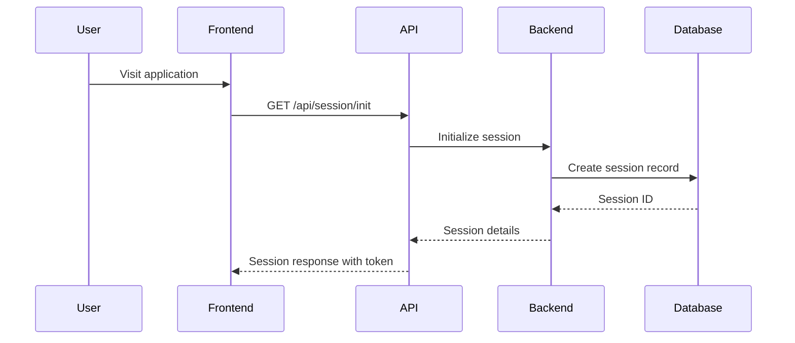
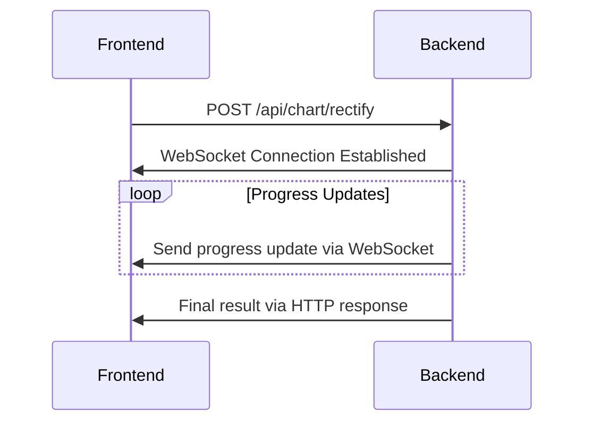
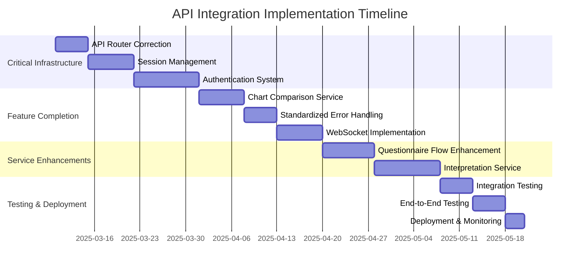

# API Integration Implementation Strategy

This document outlines the step-by-step strategy to implement the API integration flowchart and sequence diagram while closing all identified gaps.

## Table of Contents

1. [Integration Overview](#integration-overview)
2. [Step-by-Step Implementation Guide](#step-by-step-implementation-guide)
3. [Gap Closure Strategy](#gap-closure-strategy)
4. [Testing & Validation Strategy](#testing--validation-strategy)
5. [Implementation Timeline](#implementation-timeline)

## Integration Overview

The API integration implementation will focus on fully realizing the API integration flowchart and sequence diagram while systematically closing all identified gaps. The strategy takes a bottom-up approach, addressing critical infrastructure issues first, then completing core features, and finally enhancing the service layer.

## Step-by-Step Implementation Guide

### 1. API Router Correction

The dual-registration pattern for API endpoints is creating complexity and maintenance issues. We'll fix this first since it affects all endpoints.

```python
# Current implementation (problematic)
app = FastAPI()
app.include_router(chart_router, prefix="/chart", tags=["Chart"])
app.include_router(chart_router, prefix="/api/chart", tags=["Chart API"])

# Target implementation
app = FastAPI()
api_v1_router = APIRouter(prefix="/api/v1")
api_v1_router.include_router(chart_router, prefix="/chart", tags=["Chart"])
app.include_router(api_v1_router)

# Temporary backward compatibility (to be phased out)
api_legacy_router = APIRouter(prefix="/api")
api_legacy_router.include_router(chart_router, prefix="/chart", tags=["Chart Legacy"])
app.include_router(api_legacy_router)
```

**Implementation Steps:**

1. Analyze current router configuration in `ai_service/main.py`
2. Create a versioned API router structure (`/api/v1`)
3. Move all endpoint registrations to follow the new pattern
4. Add middleware for backward compatibility
5. Update all API URL references in the frontend
6. Verify all endpoints are accessible with the correct prefix

### 2. Session Management Implementation

The sequence diagram starts with a session initialization that currently doesn't exist. We'll implement this key feature next.



**Implementation Steps:**

1. Create `SessionService` class in `ai_service/services/session_service.py`
2. Add Redis integration for session storage
3. Implement session initialization endpoint at `/api/session/init`
4. Create session middleware for validation and propagation
5. Update frontend to initialize session on application load
6. Add session headers to all subsequent API requests

### 3. Authentication System Implementation

Authentication is missing but required for most API endpoints in the sequence diagram.

**Implementation Steps:**

1. Create `AuthService` class in `ai_service/services/auth_service.py`
2. Implement user registration, login, and token endpoints
3. Create JWT middleware for protected routes
4. Add role-based permission system
5. Implement token refresh mechanism
6. Update frontend authentication flow
7. Add authorization checks to all protected endpoints

### 4. Chart Comparison Service Completion

The chart comparison service is incomplete but essential for comparing original and rectified charts.

**Implementation Steps:**

1. Define complete data structures for chart differences
2. Implement chart difference detection algorithm
3. Create the `/api/chart/compare` endpoint
4. Add visualization support for differences
5. Implement caching for frequently compared charts
6. Create comprehensive tests with various chart types

### 5. Standardized Error Handling

The error handling is inconsistent across endpoints. We'll implement a standardized approach.

**Implementation Steps:**

1. Create `error_handling.py` utility module
2. Define standardized error response format and error codes
3. Implement centralized error handling middleware
4. Add field-specific validation error handling
5. Update all endpoints to use the standardized error format
6. Create client-side error handling utilities

### 6. WebSocket Implementation for Real-time Updates

Long-running processes like birth time rectification need real-time progress updates.



**Implementation Steps:**

1. Create WebSocket connection manager
2. Implement WebSocket endpoints in `ai_service/api/websockets.py`
3. Add progress tracking to long-running services
4. Create frontend WebSocket integration
5. Implement reconnection and error handling
6. Test with birth time rectification process

### 7. Questionnaire Flow Enhancement

The questionnaire flow needs improvement to support the adaptive questioning shown in the flowchart.

**Implementation Steps:**

1. Redesign questionnaire data model
2. Implement adaptive questioning algorithm
3. Create multi-step questionnaire API endpoints
4. Add progress tracking for questionnaire completion
5. Implement answer validation logic
6. Update frontend wizard interface

### 8. Interpretation Service Completion

The interpretation service is referenced but incomplete.

**Implementation Steps:**

1. Design interpretation data model
2. Implement interpretation engine for planetary positions, aspects, and houses
3. Create chart synthesis logic
4. Add personalized report generation
5. Implement the `/api/interpretation` endpoint
6. Add caching for common interpretations

## Gap Closure Strategy

This section maps each implementation step to the specific gaps identified in the gap analysis.

### Critical Infrastructure Gaps

| Gap | Implementation Step | Key Deliverables |
|-----|---------------------|------------------|
| API Router Issue | API Router Correction | Updated `main.py` with corrected router configuration |
| Missing Session Management | Session Management Implementation | `SessionService` and session endpoints |
| Missing Authentication/Authorization | Authentication System Implementation | `AuthService` and JWT middleware |

### Feature Completion Gaps

| Gap | Implementation Step | Key Deliverables |
|-----|---------------------|------------------|
| Incomplete Chart Comparison Service | Chart Comparison Service Completion | Complete chart comparison algorithm and endpoint |
| Non-standardized Error Handling | Standardized Error Handling | Centralized error handling middleware |
| Missing Real-time Updates | WebSocket Implementation | WebSocket server and progress notification system |

### Service Enhancement Gaps

| Gap | Implementation Step | Key Deliverables |
|-----|---------------------|------------------|
| Incomplete Questionnaire Flow | Questionnaire Flow Enhancement | Adaptive questioning system and multi-step API |
| Incomplete Interpretation Service | Interpretation Service Completion | Interpretation engine and personalized reports |

## Testing & Validation Strategy

To ensure the implementation correctly follows the API integration flowchart and sequence diagram, we'll use a comprehensive testing approach.

### 1. Unit Testing

- Test each service and utility function in isolation
- Use dependency injection and mocking for testing

### 2. Integration Testing

- Test interactions between components
- Verify API endpoints with authenticated and unauthenticated requests
- Test WebSocket connections and real-time updates

### 3. Sequence Testing

- Create tests that follow the exact sequence in the diagrams
- Test each step in the user flow from session initialization to chart export
- Verify the correct data is passed between components

### 4. Flowchart Path Testing

- Test each path in the flowchart
- Verify conditional branches (e.g., "Valid Details?" and "Confidence > 80%?")
- Ensure all UI/UX components interact with the correct API endpoints

### 5. End-to-End Testing

- Test complete user flows from start to finish
- Use headless browsers for frontend testing
- Verify all gaps are closed in real application usage

## Implementation Timeline

To implement this strategy effectively, we'll follow this timeline:



This timeline allows for a systematic implementation with appropriate time for each component, testing, and deployment.

## Conclusion

This step-by-step implementation strategy provides a clear roadmap for implementing the API integration flowchart and sequence diagram while closing all identified gaps. By following this approach, we'll create a robust, well-integrated API system that meets all the requirements specified in the documentation.

The strategy prioritizes critical infrastructure components first, ensuring a solid foundation, then builds up the feature set, and finally enhances the service layer for a complete implementation. The testing strategy ensures all components work together as specified in the flowcharts and diagrams.
