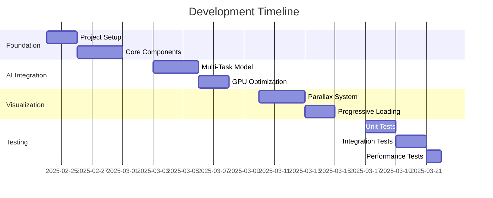
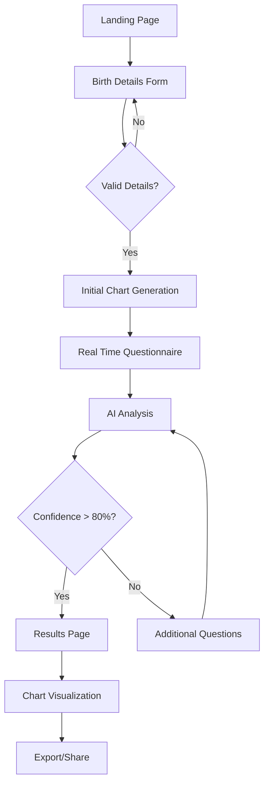

# Detailed Implementation Plan: AI Birth Time Rectification System

## 1. Project Overview

### 1.1 Core Objectives
- Create a production-ready birth time rectification system with unified AI architecture
- Implement GPU-accelerated multi-task model
- Develop immersive celestial visualization with depth-based parallax
- Establish continuous learning infrastructure
- Integrate comprehensive Vedic computation engine

### 1.2 Key Technologies
- Frontend: Next.js, React, TypeScript
- Visualization: Three.js, WebGL with GPU acceleration
- AI: PyTorch with CUDA support
- Astrological: Swiss Ephemeris (WASM-based)
- Container: Docker with NVIDIA Container Toolkit
- Testing: Jest, Cypress
- Monitoring: Prometheus, Grafana

## 2. Development Phases

### Phase 1: Foundation Setup (Week 1)

#### Day 1-2: Project Structure & Dependencies
```typescript
// Project Structure
src/
  components/
    charts/
      D1Chart.tsx
      ChartRenderer.tsx
    forms/
      BirthDetailsForm.tsx
    visualization/
      CelestialBackground.tsx
      ParallaxEngine.tsx
  services/
    ai/
      UnifiedModel.ts
      GPUManager.ts
    astrological/
      VedicEngine.ts
    questionnaire/
      AdaptiveEngine.ts
  utils/
    dateTime.ts
    validation.ts
  types/
    index.d.ts
```

#### Day 3-5: Core Components
1. Birth Details Form
```typescript
interface BirthDetails {
  date: Date;
  approximateTime: string;
  latitude: number;
  longitude: number;
  timezone: string;
  additionalFactors?: {
    majorLifeEvents: string[];
    healthHistory: string[];
  };
}

interface BirthDetailsFormProps {
  onSubmit: (details: BirthDetails) => Promise<void>;
  onValidation: (isValid: boolean) => void;
}
```

2. Unified Chart Generation
```typescript
interface ChartData {
  ascendant: number;
  planets: PlanetPosition[];
  houses: HouseData[];
  divisionalCharts: Record<string, ChartData>;
}

class UnifiedChartGenerator {
  async generateCharts(birthDetails: BirthDetails): Promise<ChartData> {
    const d1Chart = await this.generateD1Chart(birthDetails);
    const divisionalCharts = await this.generateDivisionalCharts(d1Chart);
    return {
      ...d1Chart,
      divisionalCharts
    };
  }

  private async calculateAscendant(
    timestamp: number,
    lat: number,
    lng: number
  ): Promise<number> {
    return this.vedicEngine.computeAscendant(timestamp, lat, lng);
  }
}
```

### Phase 2: Unified AI Integration (Week 2)

#### Day 1-3: Multi-Task Model Architecture
```python
class UnifiedRectificationModel:
    def __init__(self):
        self.shared_backbone = TransformerBackbone(
            hidden_size=768,
            num_layers=12,
            num_heads=12
        )
        
        self.task_heads = {
            'tattva': TattvaHead(hidden_size=768),
            'nadi': NadiHead(hidden_size=768),
            'kp': KPHead(hidden_size=768)
        }
        
    def forward(self, birth_data):
        # Shared feature extraction
        shared_features = self.shared_backbone(birth_data)
        
        # Task-specific predictions
        results = {
            name: head(shared_features)
            for name, head in self.task_heads.items()
        }
        
        # Weighted ensemble combination
        weights = {'tattva': 0.4, 'nadi': 0.35, 'kp': 0.25}
        final_rectification = sum(
            results[k] * weights[k] for k in weights
        )
        
        return final_rectification
```

#### Day 4-5: GPU Memory Management & Optimization
```python
class GPUMemoryManager:
    def __init__(self):
        self.model_allocation = 0.7  # 70% for AI model
        self.viz_allocation = 0.3  # 30% for visualization
        
    def optimize_memory(self):
        total_memory = torch.cuda.get_device_properties(0).total_memory
        torch.cuda.set_per_process_memory_fraction(self.model_allocation)
        
    def monitor_usage(self):
        current_memory = torch.cuda.memory_allocated()
        return {
            'allocated': current_memory,
            'cached': torch.cuda.memory_cached(),
            'percentage': current_memory / self.total_memory
        }
```

### Phase 3: Advanced Visualization (Week 3)

#### Day 1-3: Depth-Based Celestial Background
```typescript
class CelestialBackgroundEngine {
    private layers: CelestialLayer[];
    private scene: THREE.Scene;
    private camera: THREE.PerspectiveCamera;
    
    constructor() {
        this.initializeLayers();
        this.setupParallaxEffects();
    }
    
    private initializeLayers() {
        this.layers = [
            new CelestialLayer({
                depth: 0,
                content: 'stars',
                parallaxFactor: 0.1
            }),
            new CelestialLayer({
                depth: -100,
                content: 'nebulae',
                parallaxFactor: 0.2
            }),
            new CelestialLayer({
                depth: -200,
                content: 'galaxies',
                parallaxFactor: 0.3
            })
        ];
    }
    
    public updateParallax(scrollPosition: number): void {
        this.layers.forEach(layer => {
            layer.updatePosition(scrollPosition);
        });
        this.renderer.render(this.scene, this.camera);
    }
}
```

#### Day 4-5: Progressive Loading & Optimization
```typescript
class ProgressiveLoader {
    private textureLoader: THREE.TextureLoader;
    private qualityLevels: Map<string, number>;
    
    async loadCelestialTexture(
        path: string,
        quality: number
    ): Promise<THREE.Texture> {
        const texture = await this.textureLoader.loadAsync(path);
        texture.minFilter = THREE.LinearMipMapLinearFilter;
        texture.generateMipmaps = true;
        
        return this.optimizeTexture(texture, quality);
    }
}
```

## 3. Testing Strategy

### 3.1 Unit Testing
```typescript
describe('UnifiedRectificationModel', () => {
  let model: UnifiedRectificationModel;
  
  beforeEach(() => {
    model = new UnifiedRectificationModel();
  });
  
  test('should generate consistent predictions', async () => {
    const birthData = mockBirthData();
    const prediction = await model.predict(birthData);
    
    expect(prediction.confidence).toBeGreaterThan(0.8);
    expect(prediction.suggestedTime).toBeInstanceOf(Date);
    expect(prediction.taskResults).toHaveProperty('tattva');
    expect(prediction.taskResults).toHaveProperty('nadi');
    expect(prediction.taskResults).toHaveProperty('kp');
  });
});
```

### 3.2 Integration Testing
```typescript
describe('End-to-End Rectification Flow', () => {
  test('should process birth details and return rectification', async () => {
    const form = render(<BirthDetailsForm />);
    
    // Fill form with test data
    await userEvent.type(
      screen.getByLabelText('Date'),
      '2000-01-01'
    );
    await userEvent.type(
      screen.getByLabelText('Approximate Time'),
      '12:00'
    );
    
    // Submit form
    await userEvent.click(screen.getByText('Submit'));
    
    // Verify prediction and visualization
    await waitFor(() => {
      expect(screen.getByTestId('celestial-background')).toBeInTheDocument();
      expect(screen.getByText(/Suggested Birth Time/)).toBeInTheDocument();
      expect(screen.getByTestId('confidence-score')).toHaveTextContent(/> 80%/);
    });
  });
});
```

## 4. Deployment Configuration

### 4.1 Docker Configuration
```dockerfile
# Base Image with CUDA 12.2 and Node.js 20 LTS
FROM nvidia/cuda:12.2.0-runtime-ubuntu22.04

# System Dependencies
RUN apt-get update && \
    apt-get install -y python3.10 python3-pip nodejs npm redis-server \
    libgl1 libglib2.0-0 libxi6 libxext6 libx11-6

# AI Framework Setup
RUN pip install --no-cache-dir \
    torch==2.1.1+cu121 \
    transformers==4.38.2 \
    redis==5.0.1

# Visualization Stack
RUN npm install -g three@0.152.0 @react-three/fiber@8.14.1 \
    drei@9.57.0 react@18.2.0 next@14.1.0

# Vedic Computation Engine
COPY --from=vedic-builder /app/sweph /usr/local/lib/sweph
COPY --from=vedic-builder /app/jyotish.wasm /opt/vedic/

# Service Orchestration
COPY supervisord.conf /etc/supervisor/conf.d/
EXPOSE 3000 8000 6379
CMD ["supervisord", "-n"]
```

### 4.2 CI/CD Pipeline
```yaml
name: Deploy Birth Time Rectifier

on:
  push:
    branches: [main]
  pull_request:
    branches: [main]

jobs:
  deploy:
    runs-on: ubuntu-latest
    steps:
    - uses: actions/checkout@v4
    
    - name: Build and Push Docker
      uses: docker/build-push-action@v4
      with:
        context: .
        platforms: linux/arm64
        tags: user/birth-time-rectifier:latest
        push: true
        
    - name: Deploy to Kubernetes
      uses: steebchen/kubectl@v2
      with:
        command: rollout restart deployment/birth-time-rectifier
```

## 5. Performance Optimization

### 5.1 Initial Targets
- Page Load: < 2 seconds
- Chart Generation: < 500ms
- Prediction Time: < 1 second
- Animation FPS: > 60
- GPU Memory Usage: < 80%

### 5.2 Optimization Strategies
```typescript
// Dynamic imports for route-based code splitting
const CelestialBackground = dynamic(
  () => import('@/components/visualization/CelestialBackground'),
  {
    ssr: false,
    loading: () => <LoadingSpinner />
  }
);

// Resource preloading
const textureLoader = new THREE.TextureLoader();
const preloadTextures = async () => {
  await Promise.all([
    textureLoader.loadAsync('/textures/stars.jpg'),
    textureLoader.loadAsync('/textures/nebula.jpg'),
    textureLoader.loadAsync('/textures/galaxies.jpg')
  ]);
};
```

## 6. Success Criteria

### 6.1 Functional Requirements
- ✓ Accept and validate comprehensive birth details
- ✓ Generate accurate D1-D60 charts
- ✓ Provide time rectification with > 80% confidence
- ✓ Display immersive celestial background with parallax
- ✓ Implement adaptive questionnaire system
- ✓ Support continuous learning from user feedback
- ✓ Ensure Vedic compliance in calculations

### 6.2 Technical Requirements
- ✓ Test coverage > 90%
- ✓ Lighthouse score > 95
- ✓ Zero critical security vulnerabilities
- ✓ GPU memory optimization
- ✓ WCAG 2.1 AA compliance
- ✓ < 2s average response time

## 7. Future Enhancements

### 7.1 Planned Features
1. Advanced GPU Optimization
2. Extended Divisional Charts (D1-D144)
3. Neural Architecture Search
4. Real-time Collaborative Analysis
5. Advanced Vedic Calculations

### 7.2 Technical Debt Considerations
- Model architecture optimization
- Memory management refinement
- Caching strategy enhancement
- Performance monitoring expansion
- Error tracking improvement

## 8. Risk Management

### 8.1 Technical Risks
1. GPU Memory Constraints
2. Browser Compatibility
3. Model Accuracy
4. Data Consistency
5. System Resource Usage

### 8.2 Mitigation Strategies
1. Dynamic Resource Allocation
2. Progressive Enhancement
3. Continuous Model Validation
4. Data Integrity Checks
5. Resource Usage Monitoring

## 9. Timeline Overview



## Core prototype components
interface BirthTimeRectifierProps {
  initialData: BirthDetails;
  onRectification: (result: RectificationResult) => void;
}

class BirthTimeRectifierPrototype {
  private model: UnifiedRectificationModel;
  private chartGenerator: UnifiedChartGenerator;
  
  constructor() {
    this.model = new UnifiedRectificationModel();
    this.chartGenerator = new UnifiedChartGenerator();
  }
  
  async processRectification(details: BirthDetails): Promise<RectificationResult> {
    // 1. Basic validation
    const validatedData = await this.validateBirthDetails(details);
    
    // 2. Generate initial charts
    const charts = await this.chartGenerator.generateCharts(validatedData);
    
    // 3. Run simplified AI prediction
    const prediction = await this.model.predict(validatedData, charts);
    
    // 4. Basic visualization
    const visualization = await this.generateBasicVisualization(charts);
    
    return {
      suggestedTime: prediction.suggestedTime,
      confidence: prediction.confidence,
      charts,
      visualization
    };
  }
}

## 10. UI/UX Design and Flow

### 10.1 Page Structure
```typescript
// Page Components
pages/
  index.tsx                    // Landing page
  birth-time-rectifier/        // Main application pages
    index.tsx                  // Birth details form
    questionnaire.tsx          // Dynamic questionnaire
    analysis.tsx              // Analysis and results
    charts/                    // Chart visualization pages
      d1-chart.tsx            // Birth chart (Rashi)
      d9-chart.tsx            // Navamsa chart
      custom-charts.tsx       // Other divisional charts
    settings/                  // User preferences
      preferences.tsx         // Chart style, timezone, etc.
      account.tsx            // User account management
```

### 10.2 UI/UX Flow Chart


### 10.3 API Integration Points
```typescript
interface APIEndpoints {
  // Birth Time Rectification
  '/api/rectify': {
    POST: {
      request: BirthDetails;
      response: RectificationResult;
    };
  };
  
  // Dynamic Questionnaire
  '/api/questionnaire': {
    GET: {
      response: Question[];
    };
    POST: {
      request: QuestionnaireResponse;
      response: {
        nextQuestions: Question[];
        confidence: number;
      };
    };
  };
  
  // Chart Generation
  '/api/charts': {
    POST: {
      request: {
        birthDetails: BirthDetails;
        chartType: 'D1' | 'D9' | 'D12';
      };
      response: ChartData;
    };
  };
}
```

### 10.4 Page Designs

#### Landing Page
```typescript
interface LandingPageProps {
  features: Feature[];
  testimonials: Testimonial[];
}

const LandingPage: React.FC<LandingPageProps> = () => (
  <Layout>
    <Hero>
      <h1>Birth Time Rectification</h1>
      <p>AI-Powered Vedic Astrology Analysis</p>
      <CTAButton>Get Started</CTAButton>
    </Hero>
    
    <Features />
    <HowItWorks />
    <Testimonials />
    <CelestialBackground />
  </Layout>
);
```

#### Birth Details Form
```typescript
interface FormSection {
  title: string;
  fields: FormField[];
  validation: ValidationRules;
}

const birthDetailsForm: FormSection[] = [
  {
    title: 'Basic Information',
    fields: [
      {
        type: 'date',
        name: 'birthDate',
        label: 'Birth Date',
        required: true
      },
      {
        type: 'time',
        name: 'approximateTime',
        label: 'Approximate Birth Time',
        required: true
      },
      {
        type: 'location',
        name: 'birthPlace',
        label: 'Birth Place',
        required: true,
        geocoding: true
      }
    ]
  },
  {
    title: 'Additional Details',
    fields: [
      {
        type: 'multiSelect',
        name: 'lifeEvents',
        label: 'Major Life Events',
        options: ['Marriage', 'Career Change', 'Relocation']
      },
      {
        type: 'textArea',
        name: 'notes',
        label: 'Additional Notes'
      }
    ]
  }
];
```

#### Analysis Page
```typescript
interface AnalysisPageProps {
  birthDetails: BirthDetails;
  rectificationResult: RectificationResult;
  charts: ChartData[];
}

const AnalysisPage: React.FC<AnalysisPageProps> = () => (
  <Layout>
    <Header>
      <h1>Birth Time Analysis</h1>
      <ConfidenceIndicator value={rectificationResult.confidence} />
    </Header>
    
    <Grid>
      <ChartVisualization data={charts.d1Chart} />
      <ResultsSummary result={rectificationResult} />
      <EventTimeline events={rectificationResult.significantEvents} />
    </Grid>
    
    <ActionBar>
      <ExportButton />
      <ShareButton />
      <SaveButton />
    </ActionBar>
  </Layout>
);
```

### 10.5 User Experience Guidelines

#### Loading States
```typescript
interface LoadingState {
  type: 'initial' | 'chartGeneration' | 'aiAnalysis';
  progress: number;
  message: string;
}

const LoadingIndicator: React.FC<LoadingState> = ({ type, progress, message }) => (
  <div className="loading-container">
    <CelestialSpinner />
    <ProgressBar value={progress} />
    <LoadingMessage>{message}</LoadingMessage>
  </div>
);
```

#### Error Handling
```typescript
interface ErrorBoundaryProps {
  fallback: React.ReactNode;
  onError?: (error: Error) => void;
}

const ErrorFallback: React.FC<{ error: Error }> = ({ error }) => (
  <div className="error-container">
    <Icon type="error" />
    <h2>Something went wrong</h2>
    <p>{error.message}</p>
    <RetryButton />
  </div>
);
```

#### Responsive Design
```typescript
const breakpoints = {
  mobile: '320px',
  tablet: '768px',
  desktop: '1024px',
  wide: '1440px'
};

const ResponsiveLayout = styled.div`
  display: grid;
  grid-template-columns: repeat(auto-fit, minmax(300px, 1fr));
  gap: ${props => props.theme.spacing.md};
  
  @media (min-width: ${breakpoints.tablet}) {
    grid-template-columns: repeat(2, 1fr);
  }
  
  @media (min-width: ${breakpoints.desktop}) {
    grid-template-columns: repeat(3, 1fr);
  }
`;
```

### 10.6 Animation and Transitions

```typescript
const transitions = {
  pageTransition: {
    initial: { opacity: 0, y: 20 },
    animate: { opacity: 1, y: 0 },
    exit: { opacity: 0, y: -20 },
    transition: { duration: 0.3 }
  },
  
  chartTransition: {
    initial: { scale: 0.9, opacity: 0 },
    animate: { scale: 1, opacity: 1 },
    transition: { type: 'spring', stiffness: 200, damping: 20 }
  }
};

const AnimatedChart = motion(ChartComponent);
```

### 10.7 Accessibility Features

```typescript
const a11yConfig = {
  announcements: {
    chartGenerated: 'Birth chart has been generated',
    analysisComplete: 'Analysis complete with {confidence}% confidence',
    errorOccurred: 'An error occurred: {message}'
  },
  
  ariaLabels: {
    birthDateInput: 'Enter your birth date',
    timeInput: 'Enter your approximate birth time',
    locationSearch: 'Search for your birth place'
  },
  
  keyboardNav: {
    chartNavigation: {
      left: 'Previous house',
      right: 'Next house',
      enter: 'Select house',
      escape: 'Close details'
    }
  }
};
```
